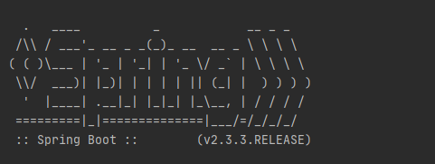
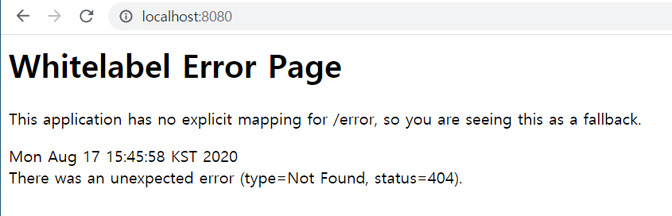
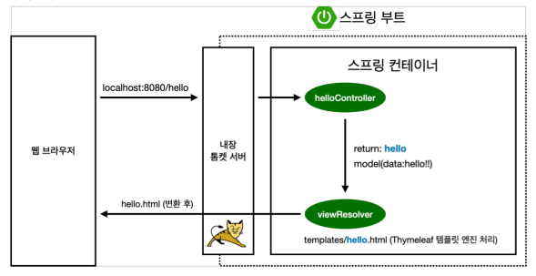
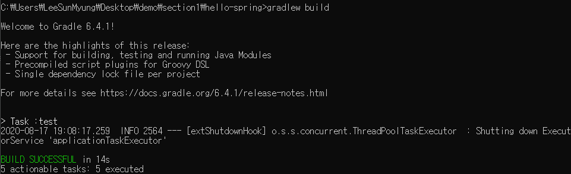
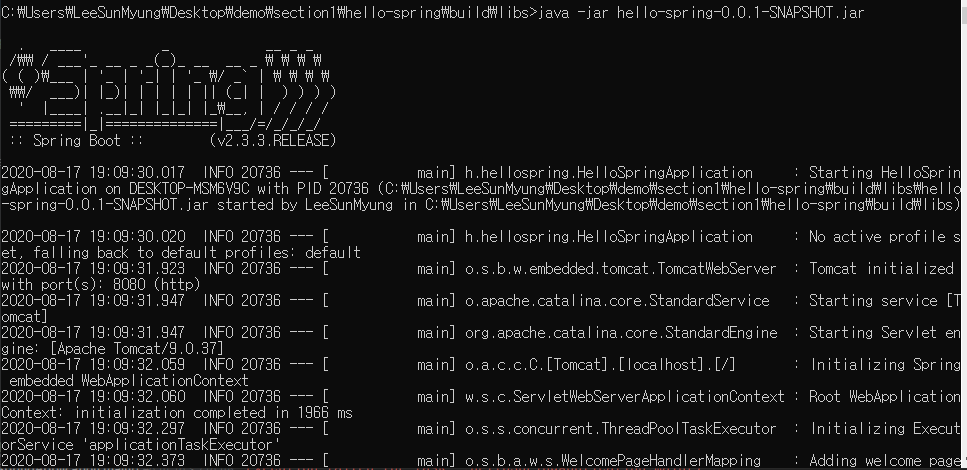
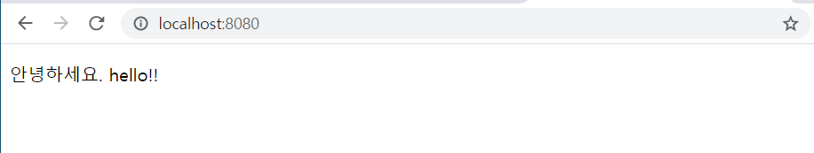

# Section1 프로젝트 환경설정
***
## 프로젝트 생성
***
### 스프링 부트 스타터 사이트로 이동해서 스프링 프로젝트 생성   
   * <https://start.spring.io>
   
+ 프로젝트 선택
  + Project: Gradle Project
  + Spring Boot: 2.3.x
  + Language: Java
  + Packaging: Jar
  + Java: 8
***   
+ Project Metadata
  + groupID: hello
  + artifactID: hello-spring
  + Dependencies: Spring Wdb, Thymeleaf
 
***
### 스프링 동작 확인

실행 시 해당 모양이 뜨고 Spring Boot Version 이 뜨고



웹브라우저에서 해당 링크로 접속하여

    http://localhost:8080



이러한 에러페이지가 뜨면 성공!!

***

## 라이브러리 살펴보기

- gradle 이나 maven같은 Build Tool들이 의존관계(Dependencies)를 관리해준다.
- 톰캣서버는 내장(embeded)되어있다.
- 라이브러리 빌드 후 실행만 하면 된다.
- log로 출력을 해야 에러를 좀더 쉽게 확인할 수 있다.

***

### 주요 라이브러리

- spring-boot-starter-web
  - spring-boot-starter-tomcat // 톰캣 서버
  - spring-webmvc // 스프링 웹 MVC
- spring-boot-thymeleaf // 타임리프 템플릿 엔진(view)
- spring-boot-starter  // 스프링 부트 + 스프링 코어 + 로깅
  - spring-core
  - spring-boot-logging
    - logback
    - slf4j

### 테스트 라이브러리

- spring-boot-starter-test
  - junit // 테스트 프레임워크
  - mockito // 목 라이브러리
  - assertj // 테스트 코드를 좀 더 편하게 작성하게 도와주는 라이브러리
  - spring-text // 스프링 통합 테스트 지원

***

## View 환경설정

### Welcome Page 만들기


    resources/static/index.html


```
<!DOCTYPE HTML>
<html>
    <head>
        <title>Hello</title>
        <meta http-equiv="Content-Type" content="text/html; charset=UTF-8" />
    </head>
    <body>
        Hello
         <a href="/hello">hello</a>
    </body>
</html>
```

- ```static/index.html```을 올려두면 Welcome page 기능을 제공한다.

### Controller Java 파일

```
package hello.hellospring.controller;

import org.springframework.stereotype.Controller;
import org.springframework.ui.Model;
import org.springframework.web.bind.annotation.GetMapping;

@Controller
public class HelloController {

    @GetMapping
    public String hello(Model model) {
        model.addAttribute("data", "hello!!");
        return "hello";
    }
}
```

- Key = "data", Value = "hello!!"

### Controller Maping hello.html

```
<!DOCTYPE HTML>
<html xmlns:th="http://www.thymeleaf.org">
    <head>
        <title>Hello</title>
        <meta http-equiv="Content-Type" content="text/html; charset=UTF-8" />
    </head>
    <body>
        <p th:text="'안녕하세요. ' + ${data}" >안녕하세요. 손님</p>
    </body>
</html>
```

- ${data}, 즉 Key 값이 data인 Controller의 Value 값으로 치환

### 동작환경



- 컨트롤러에서 리턴 값으로 문자를 반환하면 뷰 리졸버(```viewResolver```)가 화면을 찾아서 처리한다.
  - 스프링 부트 템플릿엔진 기본 viewName 매핑
  - ```resource:templates/``` + {ViewName} + ```.html```

## 빌드하고 실행하기

### 콘솔로 빌드, 실행

1. <pre><code>gradlew build</code></pre>


2. <pre><code>cd build/libs</code></pre>

3. <pre><code>java -jar hello-spring-0.0.1-SNAPSHOT.jar</code></pre>



4. 실행확인

