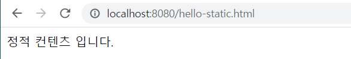
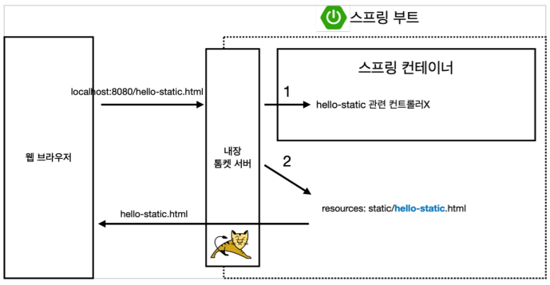
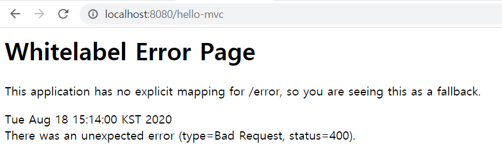
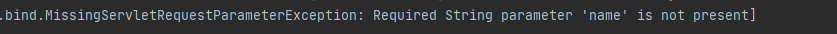
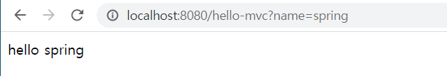
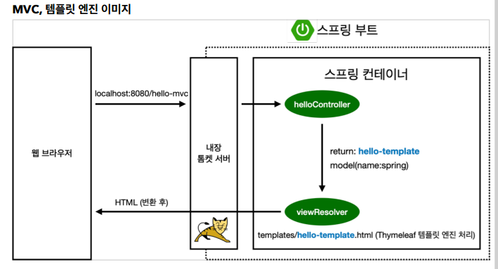
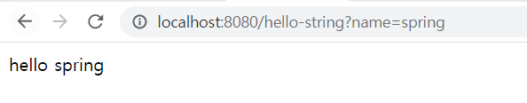
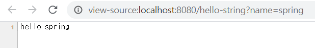
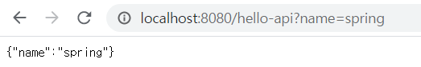
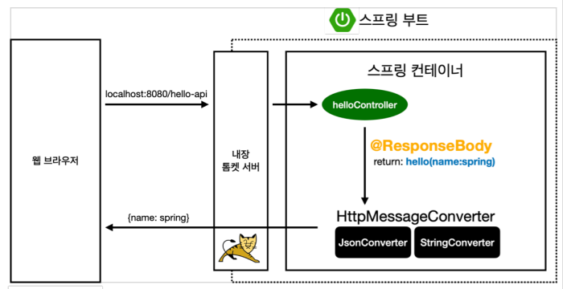

# Section2 스프링 웹 개발 기초

- 정적 컨텐츠 - HTML 파일 그대로 출력
- MVC와 템플릿 엔진 - 서버에서 HTML파일을 변형
- API - 데이터 통신

## 정적 컨텐츠

- HTML 파일 그대로 서버가 전달
- 정적인 파일이므로 프로그래밍 불가

### 코드

<pre><code>resources/static/hello-static.html</pre></code>

```
<!DOCTYPE HTML>
<html>
    <head>
        <title>static content</title>
        <meta http-equiv="Content-Type" content="text/html; charset=UTF-8" />
    </head>
    <body>
        정적 컨텐츠 입니다.
    </body>
</html>
```

### 실행화면



### 정적 컨텐츠 이미지



1. 웹브라우저에서 <pre><code>localhost:8080/hello-static.html</pre></code>을 내장 톰켓 서버에  요청한다.
2. 내장 톰켓 서버에서 스프링에 <pre><code>localhost:8080/hello-static.html</pre></code>을 넘긴다.
3. 스프링에서 먼저  컨트롤러에 hello-static이 있는지 찾아본다.
4. 컨트롤러에 해당 파일이 없으면 <pre><code>resources/static/hello-static.html</pre></code>을 찾는다.
5. 파일의 변형없이 그대로 반환한다.


## MVC와 템플릿 엔진

### MVC : Model, View, Controller

- 프로그래밍을 할 땐 관심사를 분리해야된다.(역할과 책임)
- **View**는 화면을 그리는데 모든 역량을 집중해야 한다.
- **Controller**나 **Model** 같은 경우는 비즈니스 로직에 관련이 있거나 내부 문제를 처리해야 한다.

#### Controller (HelloController.java)

***

```
@Controller
public class HelloController {

    @GetMapping("hello-mvc")
    public String helloMvc(@RequestParam("name") String name, Model model) {
        model.addAttribute("name", name);
        return "hello-template";
 }
}
```

#### View (hello-template.html)

***

```
<html xmlns:th="http://www.thymeleaf.org">
    <body>
        <p th:text="'hello ' + ${name}">hello! empty</p>
    </body>
</html>
```

#### 실행

```http://localhost:8080/hello-mvc```

#### 실행화면



#### 로그확인



- 파라미터 name의 값을 넣지 않아 에러가 생김

#### 재실행 

```http://localhost:8080/hello-mvc?name=spring```

#### 재실행화면



#### MVC, 템플릿 엔진 이미지

***



1. 웹 브라우저에서 ```localhost:8080/hello-mvc```를 넘긴다.
2. 내장 톰켓 서버에서 스프링 컨테이너에 던진다.
3. 매핑된 **helloController**에서 메서드를 호출한 뒤  **hello-template**로 리턴한다.
4. **viewResolver**에서 해당 HTML파일을 Thymeleaf 템플릿 엔진에 넘긴다.
5. 템플릿 엔진에서 파일을 랜더링한 후 변환 된 HTML 파일을 웹 브라우저에 띄운다.

**정적 컨텐츠에서는 변환이 되지 않았지만 Controller와 ViewResolver를 거치면 파일을 변환하여 보여준다.**

## API

#### @ResponseBody 문자반환

```
@Controller
public class HelloController {
    @GetMapping("hello-string")
    @ResponseBody
    public String helloString(@RequestParam("name") String name) {
     return "hello " + name;
 }
}
```

- **@ResponseBody** 의미 : 데이터 Body에 직접 데이터 삽입


#### 실행화면



#### 소스코드보기



- 정적컨텐츠나 MVC, 템플릿 엔진 예제에서는 소스코드 보기를 할 경우 HTML 코드가 나왔지만 API에서는 데이터 값만 나옴.
- 템플릿 엔진은 HTML파일을 조작하여 HTML 화면을 보여주는 방식이지만 API는 데이터를 그대로 내려줌.

#### @ResponseBody 객체반환

```
@GetMapping("hello-api")
@ResponseBody
public Hello helloApi(@RequestParam("name") String name) {
    Hello hello = new Hello();
    hello.setName(name);
    return hello;
}
static class Hello {
    private String name;
    public String getName() {
        return name;
    }
    public void setName(String name) {
        this.name = name;
    }
}
```

- 변수를 private로 선언하고 get, set을 통해 변수 활용 // property 접근방식

#### 실행

```http://localhost:8080/hello-api?name=spring```

#### 실행화면



### @ResponseBody 사용원리



1. 웹 브라우저에서 ```localhost:8080/hello-api```를 넘긴다.
2. 내장 톰켓 서버에서 스프링 컨테이너에 던진다.
3. 스프링이 **@ResponseBody**를 보고 **hello** 객체를 **HttpMessageConverter**에 넘긴다.
4. **HttpMessageConverter**에서 리턴값을 보고 리턴값이 String 일 경우 **StringConverter**가 동작하고 리턴값이 객체일 경우 **JsonConverter**가 동작한다.
  - 기본 문자처리: ```StringHttpMessageConverter```
  - 기본 객체처리: ```MappingJackson2HttpMessageConverter```
5. Converter에서 처리 후 웹 브라우저에 띄운다.
