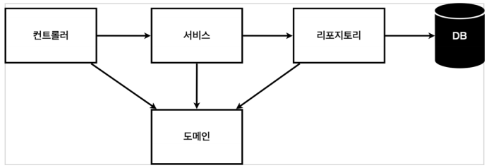
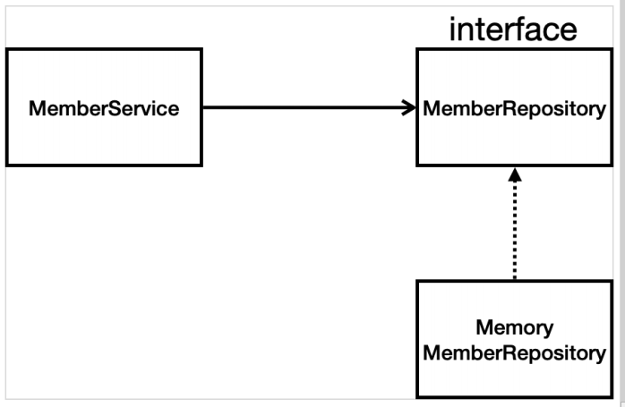

# Section3 회원 관리 예제 - 백엔드 개발

1. 비지니스 요구사항 정리
2. 회원 도메인과 리포지토리 만들기
3. 회원 리포지토리 테스트 케이스 작성
4. 회원 서비스 개발
5. 회원 서비스 테스트

## 비지니스 요구사항 정리

- 데이터 : 회원ID, 이름
- 기능 : 회원 등록, 조회
- 아직 데이터 저장소가 선정되지 않음(가상의 시나리오)

### 일반적인 웹 애플리케이션 계층 구조



- 컨트롤러 : 웹 MVC의 컨트롤러 역할
- 서비스 : 핵심 비즈니스 로직 구현
- 리포지토리 : 데이터베이스에 접근, 도메인 객체를 DB에 저장하고 관리
- 도메인 : 비즈니스 도메인 객체, 예) 회원, 주문, 쿠폰 등등 주로 데이터베이스에 저장하고 관리됨

### 클래스 의존관계



- 아직 데이터 저장소가 선정되지 않아서, 우선 인터페이스로 구현 클래스를 변경할 수 있도록 설계
- 데이터 저장소는 RDB, NoSQL 등등 다양한 저장소를 고민중인 상황으로 가정
- 개발을 진행하기 위해서 초기 개발 단계에서는 구현체로 가벼운 메모리 기반의 데이터 저장소 사용

***

## 회원 도메인과 리포지토리 만들기

### 회원 객체

```
public class Member {

    private  Long id;
    private  String name;

    public Long getId() {
        return id;
    }
    public void setId(Long id) {
        this.id = id;
    }
    public String getName() {
        return name;
    }
    public void setName(String name) {
        this.name = name;
    }
}
```

### 회원 리포지토리 인터페이스

```
package hello.hellospring.repository;

import hello.hellospring.domain.Member;

import java.util.List;
import java.util.Optional;

public abstract class MemberRepository {

    abstract Member save(Member member);
    abstract Optional<Member> findById(Long id);
    abstract Optional<Member> findByName(String name);
    abstract List<Member> findAll();

}
```

### 회원 리포지토리 메모리 구현체

```
package hello.hellospring.repository;

import hello.hellospring.domain.Member;
import java.util.*;

public class MemoryMemberRepository extends MemberRepository {

    private static Map<Long, Member> store = new HashMap<>();
    private static long sequence = 0L;

    @Override
    public Member save(Member member) {
        member.setId(++sequence);
        store.put(member.getId(), member);
        return member;
    }

    @Override
    public Optional<Member> findById(Long id) {
        return Optional.ofNullable(store.get(id));
    }

    @Override
    public Optional<Member> findByName(String name) {
        return store.values().stream()
                .filter(member -> member.getName().equals(name))
                .findAny();
    }

    @Override
    public List<Member> findAll() {
        return new ArrayList<>(store.values());
    }
    
    public void clearStore() {
        store.clear();
    }
}

```

***

## 회원 리포지토리 테스트 케이스 작성

- 개발한 기능을 테스트 할 때 main메서드나 웹 애플리케이션의 컨트롤러를 통해서 실행할 경우
  - 준비하고 실행하는데 오래 걸린다.
  - 반복 실행하기 어렵다.
  - 여러 테스트를 한번에 실행하기 어렵다.

+ JUnit이라는 프레임워크로 테스트를 실행해서 이러한 문제를 해결한다.

### 테스트 케이스 전체 코드

<code><pre>src/test/java/hello.hellospring.repository.MemoryMemberRepositoryTest</code></pre>

```
package hello.hellospring.repository;

import hello.hellospring.domain.Member;
import org.assertj.core.api.Assertions;
import org.junit.jupiter.api.AfterEach;
import org.junit.jupiter.api.Test;

import java.util.List;

import static org.assertj.core.api.Assertions.*;


class MemoryMemberRepositoryTest {

    MemberRepository repository = new MemoryMemberRepository();

    @AfterEach
    public void  afterEach() {
        repository.clearStore();
    }

    @Test
    public  void save() {
        Member member = new Member();
        member.setName("spring");

        repository.save(member);

        Member result = repository.findById(member.getId()).get();
        assertThat(member).isEqualTo(result);
    }

    @Test
    public void findByName() {
        Member member1 = new Member();
        member1.setName("spring1");
        repository.save(member1);

        Member member2 = new Member();
        member2.setName("spring2");
        repository.save(member2);

        Member result = repository.findByName("spring1").get();

        assertThat(result).isEqualTo(member1);
    }

    @Test
    public void findAll() {
        Member member1 = new Member();
        member1.setName("spring1");
        repository.save(member1);

        Member member2 = new Member();
        member2.setName("spring2");
        repository.save(member2);

        List<Member> result = repository.findAll();

        assertThat(result.size()).isEqualTo(2);
    }
}
```

1. afterEach()

```
@AfterEach
    public void  afterEach() {
        repository.clearStore();
    }
```

- 데이터 충돌을 방지하기 위해 메서드 끝날 때 마다 Clear

2. save() 메서드 테스트

```
@Test
    public  void save() {
        Member member = new Member();
        member.setName("spring");

        repository.save(member);

        Member result = repository.findById(member.getId()).get();
        assertThat(member).isEqualTo(result);
    }
```

- save(member) 값이 제대로 반환되는지 테스트
- <code><pre>assertThat(member).isEqualTo(result);</code></pre>
  - 테스트 케이스 result 와 member 값이 동일하면 정상작동

3. findByName() 메서드 테스트

```
@Test
    public void findByName() {
        Member member1 = new Member();
        member1.setName("spring1");
        repository.save(member1);

        Member member2 = new Member();
        member2.setName("spring2");
        repository.save(member2);

        Member result = repository.findByName("spring1").get();

        assertThat(result).isEqualTo(member1);
    }
```
- 'Member result = repository.findByName("spring1").get();'
  - result에 mamber1과 동일한 spring1 을 할당
- 'assertThat(result).isEqualTo(member1);'
  - 테이스 케이스 result와 member1의 값이 동일하면 정상작동

4. findAll() 메서드 테스트

```
@Test
    public void findAll() {
        Member member1 = new Member();
        member1.setName("spring1");
        repository.save(member1);

        Member member2 = new Member();
        member2.setName("spring2");
        repository.save(member2);

        List<Member> result = repository.findAll();

        assertThat(result.size()).isEqualTo(2);
    }
```

- 'List<Member> result = repository.findAll();'
  - result에 repository 모든 데이터 삽입 == findAll()
- 'assertThat(result.size()).isEqualTo(2);'
  - 현재 member1과 member2의 데이터만 존재하므로 데이터 개수가 2개 인지 확인


- '@AfterEach' : 한번에 여러 테스트를 실행하면 메모리 DB에 직적 테스트의 결과가 남을 수 있다. 이렇게 되면 다음 이전 테스트 떄문에 다음 테스트가 실패할 가능성이 있다. '@AfterEach'를 사용하면 각 테스트가 종료될 때 마다 이 기능을 실행한다. 여기서는 메모리 DB에 저장된 데이터를 삭제한다.
- 테스트는 각각 독립적으로 실행되어야 한다. 테스트 순서에 의존관계가 있는 것은 좋은 테스트가 아니다.


***

## 회원 서비스 개발

### 서비스 전체 코드

<code><pre>hello.hellocpring.service.MemberService</code></pre>

```
package hello.hellospring.sevice;

import hello.hellospring.domain.Member;
import hello.hellospring.repository.MemberRepository;
import hello.hellospring.repository.MemoryMemberRepository;

import java.util.List;
import java.util.Optional;

public class MemberService {

    private final MemberRepository memberRepository = new MemoryMemberRepository();

    /**
     * 회원 가입
     */
    public Long join(Member member){
        //같은 이름이 있는 중복 회원x
        validateDuplicateMember(member); //중복 회원 검증

        memberRepository.save(member);
        return  member.getId();
    }

    private void validateDuplicateMember(Member member) {
        memberRepository.findByName(member.getName())
                        .ifPresent(m -> {
                        throw new IllegalStateException("이미 존재하는 회원입니다.");
                    });
    }

    /**
     * 전체 회원 조회
     */
    public List<Member> findMembers() {
        return memberRepository.findAll();
    }

    public Optional<Member> findOne(Long memberId) {
        return memberRepository.findById(memberId);
    }
}
```

***

### 1. join() 메서드

```
    public Long join(Member member){
        //같은 이름이 있는 중복 회원x
        validateDuplicateMember(member); //중복 회원 검증

        memberRepository.save(member);
        return  member.getId();
    }
```

- 회원가입을 하는 메서드이다.
- <code><pre>validateDuplicateMember(member)</code></pre> 는 중복 회원을 검증하는 메서드이다.


### 2. validateDuplicateMember() 메서드

```
    private void validateDuplicateMember(Member member) {
        memberRepository.findByName(member.getName())
                        .ifPresent(m -> {
                        throw new IllegalStateException("이미 존재하는 회원입니다.");
                    });
    }
```

- 중복 회원을 검사하는 메서드이다.
- 회원가입하는 사람의 이름을 `memberRepository`에서 찾고 있으면 중복 에러 메시지를 보낸다.

### 3. 회원 조회 (findMembers() / findOne())

```
    public List<Member> findMembers() {
        return memberRepository.findAll();
    }

    public Optional<Member> findOne(Long memberId) {
        return memberRepository.findById(memberId);
    }
```

- findMembers() 메서드의 경우 `memberRepository`에 있는 모든 회원 정보를 불러온다.
- fidnOne() 메서드의 경우 `memberRepository`에서 해당 아이디의 회원 정보를 불러온다.

***

## 회원 서비스 테스트

- 테스트 할 클래스에서 **Ctrl + Shift + T** 를 누르면 테스트 클래스 손쉽게 만들 수 있다.
- 국내 사람들과 협업시에는 테스트 메서드는 한글로 작성이 용이하다.
- 테스트 메서드 내에서 <code><pre>//given //when //then</code></pre>주석 다음 given에는 주어진 값 when에는 실행할 행동 then에는 결과 값을 적는 것이 나중에 확인하기 편하다.

### 서비스 테스트 전체 코드

```
package hello.hellospring.sevice;

import hello.hellospring.domain.Member;
import hello.hellospring.repository.MemoryMemberRepository;
import org.junit.jupiter.api.AfterEach;
import org.junit.jupiter.api.Assertions;
import org.junit.jupiter.api.BeforeEach;
import org.junit.jupiter.api.Test;

import static org.assertj.core.api.Assertions.assertThat;
import static org.junit.jupiter.api.Assertions.*;

class MemberServiceTest {

    MemberService memberService;
    MemoryMemberRepository memberRepository;

    @BeforeEach
    public void beforEach() {
        memberRepository = new MemoryMemberRepository();
        memberService = new MemberService(memberRepository);
    }

    @AfterEach
    public void afterEach() {
        memberRepository.clearStore();
    }

    @Test
    void 회원가입() {
        //given
        Member member = new Member();
        member.setName("hello");

        //when
        Long saveId = memberService.join(member);

        //then
        Member findMember = memberService.findOne(saveId).get();
        assertThat(member.getName()).isEqualTo(findMember.getName());
    }

    @Test
    public void 중복_회원_예외() {
        //given
        Member member1 = new Member();
        member1.setName("spring");

        Member member2 = new Member();
        member2.setName("spring");

        //When
        memberService.join(member1);
        IllegalStateException e = assertThrows(IllegalStateException.class,
                () -> memberService.join(member2));   //예외가 발생해야 한다.
        assertThat(e.getMessage()).isEqualTo("이미 존재하는 회원입니다.");

        //then
    }
}
```

- `@BeforeEach` : 각 테스트 실행 전에 호출된다. 테스트가 서로 영향이 없도록 항상 새로운 객체를 생성하고, 의존관계도 새로 맺어준다.