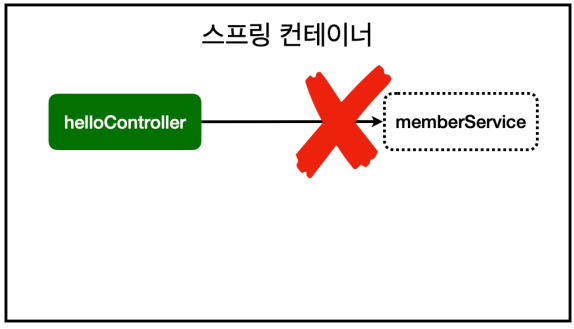
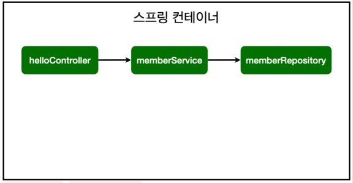

# Section4 스프링 빈과 의존관계

***

## 컴포넌트 스캔과 자동 의존관계 설정

- 회원 컨트롤러가 회원서비스와 회원 리포지토리를 사용할 수 있게 의존관계를 준비하자.

## 자바 코드로 직접 스프링 빈 등록하기

### 회원 컨트롤러에 의존관계 추가

`hello.hellospring.service.MemberService.MemberController`

```
package hello.hellospring.controller;


import hello.hellospring.sevice.MemberService;
import org.springframework.beans.factory.annotation.Autowired;
import org.springframework.stereotype.Controller;

@Controller
public class MemberController {

    private final MemberService memberService;

    @Autowired
    public MemberController(MemberService memberService) {
        this.memberService = memberService;
    }
}
```

- 생성자에 `@Autowired` 가 있으면 스프링이 연관된 객체를 스프링 컨테이너에서 찾아서 넣어준다. 이렇게 객체 의존관계를 외부에서 넣어주는 것을 DI(Dependency Injection), 의존성 주입이라고 한다.
- 이전 테스트에서는 개발자가 직접 주입했고, 여기서는 `@Autowired` 에 의해 스프링이 주입해준다.

### 오류 발생

```Consider defining a bean of type 'hello.hellospring.service.MemberService' in your configuration.```

### 발생 이유

member Service가 스프링 빈으로 등록되어 있지 않다.


- 참고 : helloController는 스프링이 제공하는 컨트롤러여서 스프링 빈으로 자동 등록된다. `@Controller`가 있으면 자동 등록됨

### 스프링 빈을 등록하는 2가지 방법

- 컴포넌트 스캔과 자동 의존관계 설정
- 자바 코드로 직접 스프링 빈 등록하가

### 컴포넌트 스캔과 자동 의존관계 설정

- `@Component` 에노테이션이 있으면 스프링 빈으로 자동 등록된다.
- `@Controller` 컨트롤러가 스프링 빈으로 자동 등록된 이유도 컴포넌트 스캔 때문이다.

- `@Component`를 포함하는 다음 에노테이션도 스프링 빈으로 자동 등록된다.
  - `@Controller`
  - `@Service`
  - `@Repository`

- `hello.hellospring` 하위 패키지만 컴포넌트 스캔의 대상이다.

### 스프링 빈 등록 이미지



- `memberService`와 `memberRepository`가 스프링 컨테이너에 스프링 비느올 등록되었다.

    >참고: 스프링은 스프링 컨테이너에 스프링 빈을 등록할 때, 기본으로 싱글톤으로 등록한다.(유일하게 하나만 등록해서 공유) 따라서 같은 스프링 빈이면 모두 같은 인스턴스다. 설정으로 싱글톤이 아니게 설정할 수 있지만, 특별한 경우를 제외하면 대부분 싱글톤을 사용한다.

## 자바 코드로 직접 스프링 빈 등록하기

- 회원 서비스와 회원 리포지토리의 @Service, @Repository, @Autowired 애노테이션을 제거하고 진행한다.


`hello.hellospring.SpringConfig`

```
package hello.hellospring;

import hello.hellospring.domain.Member;
import hello.hellospring.repository.MemberRepository;
import hello.hellospring.repository.MemoryMemberRepository;
import hello.hellospring.sevice.MemberService;
import org.springframework.context.annotation.Bean;
import org.springframework.context.annotation.Configuration;

@Configuration
public class SpringConfig {

    @Bean
    public MemberService memberService() {
        return new MemberService(memberRepository());
    }

    @Bean
    public MemberRepository memberRepository() {
        return  new MemoryMemberRepository();
    }
}
```

- 향후 메모리 리포지토리를 다른 리포지토리로 변경할 예정이므로, 컴포넌트 스캔 방식 대신에 자바 코드로 스프링 빈을 설정한다.

> DI(Dependency Injection)에는 필드주입, setter 주입, 생성자 주입 이렇게 3가지 방법이 있다. 의존관계가 실행중에 동적으로 변하는 경우는 거의 없으므로 생성자 주입을 권장한다.

> 실무에서는 주로 정형화된 컨트롤러, 서비스, 리포지토리 같은 코드는 컴포넌트 스캔을 사용한다. 정형화 되지 않거나, 상황에 따라 구현 클래스를 변경해야 하면 설정을 통해 스프링 빈으로 등록한다.

> 주의 : `@Autowired`를 통한 DI는 `helloController`,`memberService`등과 같이 스프링이 관리하는 객체에서만 동작한다. 스프링 빈으로 등록하지 않고 내가 직접 생성한 객체에서는 동작하지 않는다.
