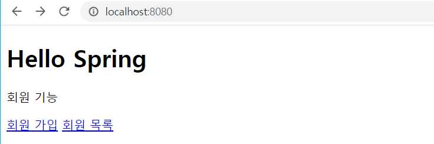

# Section5 회원관리 예제 - 웹 MVC 개발

1. 회원 웹 기능 - 홈 화면 추가
2. 회원 웹 기능 - 등록
3. 회원 웹 기능 - 조회

## 회원 웹 기능 - 홈 화면 추가

### 홈 컨트롤러 추가

```
package hello.hellospring.controller;

import org.springframework.stereotype.Controller;
import org.springframework.web.bind.annotation.GetMapping;

@Controller
public class HomeController {

    @GetMapping("/")
    public String home() {
        return "home";
    }
}

```

### 회원 관리용 홈

```
<!DOCTYPE HTML>
<html xmlns:th="http://www.thymeleaf.org">
<body>
<div class="container">
    <div>
        <h1>Hello Spring</h1>
        <p>회원 기능</p>
        <p>
            <a href="/members/new">회원 가입</a>
            <a href="/members">회원 목록</a>
        </p>
    </div>
</div> <!-- /container --></body>
</html>
```

### 실행 화면



- 기존의 웰컴페이지(index.html)보다 컨트롤러가 우선순위가 높기 때문에 `localhost:8080`이 index.html 을 띄우지 않고 home.html 을 띄운다.

## 회원 웹 기능 - 등록

### 회원 등록 폼 컨트롤러

`hello.hellospring.controller.MemberContreoller`


```
    @GetMapping("/members/new")
    public String createForm() {
        return "members/createMemberForm";
    }

    @PostMapping("/members/new")
    public String create(MemberForm form) {
        Member member = new Member();
        member.setName(form.getName());

        memberService.join(member);

        return "redirect:/";
    }
```

- `@GetMapping("/members/new")` 는 templates 에 있는 html 파일을 매핑해준다.

### 회원 등록 폼 HTML

```
<!DOCTYPE HTML>
<html xmlns:th="http://www.thymeleaf.org">

<body>
    <div class="container">
        
        <form action="/members/new" method="post">
            <div class="form-group">
                <label for="name">이름</label>
                <input type="text" id="name" name="name" placeholder="이름을 입력하세요">
            </div>
            <button type="submit">등록</button>
        </form>
        
    </div> <!-- /container -->

</body>
</html>
```

## 회원 웹 기능 - 조회

### 회원 컨트롤러에서 조회 기능 매핑

```
    @GetMapping(value = "/members")
    public String list(Model model) {
        List<Member> members = memberService.findMembers();
        model.addAttribute("members", members);
        return "members/memberList";
    }
```

### 회원 리스트 HTML

```
<!DOCTYPE HTML>
<html xmlns:th="http://www.thymeleaf.org">
<body>

    <div class="container">
        <div>

            <table>
                <thead>
                <tr>
                    <th>#</th> <th>이름</th>
                </tr>
                </thead>

                <tbody>
                <tr th:each="member : ${members}">
                    <td th:text="${member.id}"></td>
                    <td th:text="${member.name}"></td>
                </tr>
                </tbody>
            </table>

        </div>
    </div> <!-- /container -->

</body>
</html>
```

