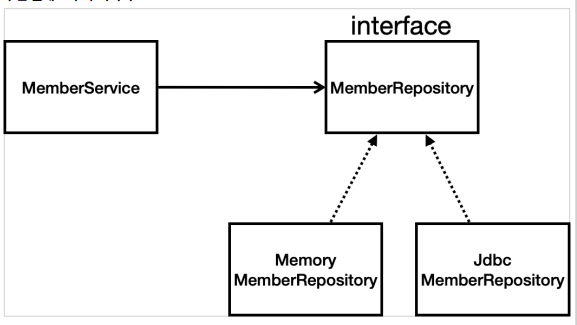
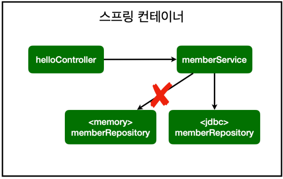
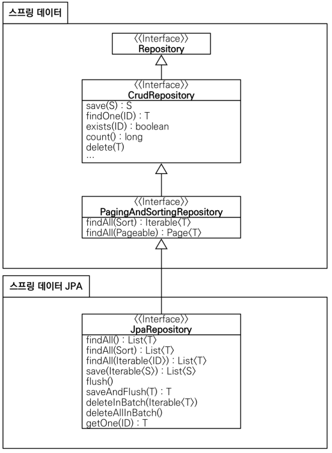

# Section6 스프링 DB 접근 기술

   스프링 데이터 엑세스

- H2 데이터베이스 설치
- 순수 Jdbc
- 스프링 통합 테스트
- 스프링 JdbcTemplate
- JPA
- 스프링 데이터 JPA

## H2 데이터 베이스 설치

  개발이나 테스트 용도로 가볍고 편리한 DB, 웹 화면 제공

- https://www.h2database.com
- 다운로드 및 설치
- h2 데이터베이스 버전은 스프링 부트 버전에 맞춘다.
- 권한 주기 : `chmod 775 h2.sh`
- 실행 : `./h2.sh`
- 데이터베이스 파일 생성 방법
  - `jdbc:h2:~/test` (최초버전)
  - `~/test.mv.db` 파일 생성 확인
  - 이후부터는 `jdbc:h2:tcp://localhost/~/test` 로 접속

### 테이블 생성하기

  테이블 관리를 위해 프로젝트 루트에 `sql/ddl.sql` 파일을 생성

### 테이블 생성 코드

```
drop table if exists member CASCADE;
create table member
(
    id bigint generated by default as identity,
    name varchar(255),
    primary key (id)
);
```

H2 데이터베이스에 접근해서 `member` 테이블 생성

***

## 순수 Jdbc

### 환경 설정

1. build.gradle 파일에 jdbc, h2 데이터베이스 관련 라이브러리 추가

```
implementation 'org.springframework.boot:spring-boot-starter-jdbc'
runtimeOnly 'com.h2database:h2'
```

2. 스프링 부트 데이터베이스 연결 설정 추가

`resources/application.properties`

```
spring.datasource.url=jdbc:h2:tcp://localhost/~/test
spring.datasource.driver-class-name=org.h2.Driver
```

### 스프링 설정 변경

```
package hello.hellospring;

import hello.hellospring.domain.Member;
import hello.hellospring.repository.JdbcMemberRepository;
import hello.hellospring.repository.MemberRepository;
import hello.hellospring.repository.MemoryMemberRepository;
import hello.hellospring.sevice.MemberService;
import org.springframework.beans.factory.annotation.Autowired;
import org.springframework.context.annotation.Bean;
import org.springframework.context.annotation.Configuration;

import javax.sql.DataSource;

@Configuration
public class SpringConfig {

    private final DataSource dataSource;

    @Autowired
    public SpringConfig(DataSource dataSource) {
        this.dataSource = dataSource;
    }

    @Bean
    public MemberService memberService() {
        return new MemberService(memberRepository()); 
    }

    @Bean
    public MemberRepository memberRepository() {
//        return  new MemoryMemberRepository();
        return new JdbcMemberRepository(dataSource);
    }
}

```

- DataSource는 데이터베이스 커넥션을 획득할 때 사용하는 객체다. 스프링 부트는 데이터베이스 커넥션 정보를 바탕으로 DataSource를 생성하고 스프링 빈으로 만들어둔다. 그래서 DI를 받을 수 있다.

### 구현 클래스 추가 이미지



- `MemberService`는 `MemberRepository`를 의존하고 있다.
- `MemberRepository`의 구현체는 `MemoryMemberRepository`,`JdbcMemberRepository`이다.

### 스프링 설정 이미지



- 기존에 등록되어있던 `<memory>memberRepository`의 연결을 끊고 `<jdbc>memberRepository`로 등록하였다.
- 개방-폐쇄 원칙(OCP, Open-Closed Principle)
  - 확장에는 열려있고, 수정, 변경에는 닫혀있다.
- 스프링의 DI를 사용하면 **기존 코드를 전혀 손대지 않고, 설정만으로 구현 클래스를 변경**할 수 있다.
- 회원을 등록하고 DB에 결과가 잘 입력되는지 확인한다.
- 데이터를 DB에 저장하므로 스프링 서버를 다시 실행해도 데이터가 안전하게 저장된다.

***

## 스프링 통합 테스트

```
@SpringBootTest
@Transactional
public class MemberServiceIntergrationTest {

    @Autowired MemberService memberService;
    @Autowired MemberRepository memberRepository;

    @Test
    public void 회원가입() throws Exception {
        //Given
        Member member = new Member();
        member.setName("hello");
        //When
        Long saveId = memberService.join(member);
        //Then
        Member findMember = memberRepository.findById(saveId).get();
        assertEquals(member.getName(), findMember.getName());
    }
    @Test
    public void 중복_회원_예외() throws Exception {
        //Given
        Member member1 = new Member();
        member1.setName("spring");
        Member member2 = new Member();
        member2.setName("spring");
        //When
        memberService.join(member1);
        IllegalStateException e = assertThrows(IllegalStateException.class, () -> memberService.join(member2));//예외가 발생해야 한다.
        assertThat(e.getMessage()).isEqualTo("이미 존재하는 회원입니다.");
    }
}
```

- `@SpringBootTest` : 스프링 컨테이너와 테스트를 함께 실행한다.
- `@Transactional` : 테스트 케이스에 해당 에노테이션이 있으면, 테스트 시작 전에 트랜잭션을 시작하고, 테스트 완료 후 롤백한다.
  - 이렇게 하면 DB에 데이터가 남지 않으므로 다음 테스트에 영향을 주지 않는다.

***

## 스프링 JdbcTemplate

- 순수 Jdbc와 동일한 환경설정
- 스프링 JdbcTemplate과 MyBatis 같은 라이브러리는 JDBC API에서 본 반복 코드를 대부분 제거해준다. 하지만 SQL은 직접 작성해야한다.

### 스프링 Jdbc Template 회원 리포지토리

```
public class JdbcTemplateMemberRepository extends MemberRepository {

    private final JdbcTemplate jdbcTemplate;

    public JdbcTemplateMemberRepository(DataSource dataSource) {
        jdbcTemplate = new JdbcTemplate(dataSource);
    }

    @Override
    public Member save(Member member) {
        SimpleJdbcInsert jdbcInsert = new SimpleJdbcInsert(jdbcTemplate);
        jdbcInsert.withTableName("member").usingGeneratedKeyColumns("id");

        Map<String, Object> parameters = new HashMap<>();
        parameters.put("name", member.getName());

        Number key = jdbcInsert.executeAndReturnKey(new MapSqlParameterSource(parameters));
        member.setId(key.longValue());
        return member;
    }

    @Override
    public Optional<Member> findById(Long id) {
        List<Member> result = jdbcTemplate.query("select * from member where id = ?", memberRowMapper(), id);
        return result.stream().findAny();
    }

    @Override
    public Optional<Member> findByName(String name) {
        List<Member> result = jdbcTemplate.query("select * from member where name = ?", memberRowMapper(), name);
        return result.stream().findAny();
    }

    @Override
    public List<Member> findAll() {
        return jdbcTemplate.query("select * from member", memberRowMapper());
    }

    private RowMapper<Member> memberRowMapper() {
        return (rs, rowNum) -> {

            Member member = new Member();
            member.setId(rs.getLong("id"));
            member.setName(rs.getString("name"));
            return member;
        };
    }

    @Override
    public void clearStore() {

    }
}
```

### JdbcTemplate을 사용하도록 스프링 설정 변경

```
@Bean
    public MemberRepository memberRepository() {
//      return new MemoryMemberRepository();
//      return new JdbcMemberRepository(dataSource);
        return new JdbcTemplateMemberRepository(dataSource);
    }
```

- 기존 순수 Jdbc에서는 `JdbcMemberRepositopry(dataSource);`에 연결하였다.
- 기존 연결을 끊고 새로 `JdbcTemplateMemberRepository(dataSource)`에 연결

***

## JPA

### JPA와 JdbcTemplate 차이

- JdbcTemplate은  JDBC API에서 본 반복 코드를 대부분 제거해주지만 SQL은 직접 작성해야한다.

- JPA는 기존의 반복 코드는 물론이고, 기본적인 SQL도 JPA가 직접 만들어서 실행해준다.
- JPA를 사용하면, SQL과 데이터 중심의 설계에서 객체 중심의 설계로 패러다임을 전환을 할 수 있다.
- JPA를 사용하면 개발 생산성을 크게 높일 수 있다.

### build.gradle 파일에 JPA, h2 데이터베이스 관련 라이브러리 추가

```
dependencies {
	implementation 'org.springframework.boot:spring-boot-starter-thymeleaf'
	implementation 'org.springframework.boot:spring-boot-starter-web'
//	implementation 'org.springframework.boot:spring-boot-starter-jdbc'
	implementation 'org.springframework.boot:spring-boot-starter-data-jpa'
	runtimeOnly 'com.h2database:h2'

	testImplementation('org.springframework.boot:spring-boot-starter-test') {
		exclude group: 'org.junit.vintage', module: 'junit-vintage-engine'
	}
}

```

- `spring-boot-starter-data-jpa`는 내부에 jdbc관련 라이브러리를 포함한다. 따라서 jdbc는 제거해도 된다.(주석처리)

### 스프링부트에 JPA 설정 추가

`resources/application.properties`

```
spring.datasource.url=jdbc:h2:tcp://localhost/~/test
spring.datasource.drive-class-name=org.h2.Driver
spring.jpa.show-sql=true
spring.jpa.hibernate.ddl-auto=none
```

- `show-sql` : JPA가 생성하는 SQL을 출력
- `ddl-auto` : JPA는 테이블을 자동으로 생성하는 기능을 제공하는데 `none`을 사용하면 해당 기능을 끈다.
  - `create`를 사용하면 엔티티 정보를 바탕으로 테이블도 직접 생성해준다.

### JPA 엔티티 매핑

```
@Entity
public class Member {

    @Id @GeneratedValue
    private  Long id;
    private  String name;

    public Long getId() {
        return id;
    }
    public void setId(Long id) {
        this.id = id;
    }
    public String getName() {
        return name;
    }
    public void setName(String name) {
        this.name = name;
    }
}
```

### JPA 회원 리포지토리

```
public class JpaMemberRepository extends MemberRepository {

    private final EntityManager em;

    public JpaMemberRepository(EntityManager em) {
        this.em = em;
    }

    @Override
    public Member save(Member member) {
        em.persist(member);
        return member;
    }

    @Override
    public Optional<Member> findById(Long id) {
       Member member = em.find(Member.class, id);
        return Optional.ofNullable(member);
    }

    @Override
    public Optional<Member> findByName(String name) {
        List<Member> result = em.createQuery("select m from Member m where m.name = :name", Member.class)
                .setParameter("name", name)
                .getResultList();
        return result.stream().findAny();
    }

    @Override
    public List<Member> findAll() {
        return em.createQuery("select m from Member m", Member.class)
                .getResultList();
    }

    @Override
    public void clearStore() {

    }

}
```

### 서비스 계층에 트랜잭션 추가

```
import org.spirngframework.transaction.annotation.Transactional

@Transactional
public class MemberService {
```

- `org.spirngframework.transaction.annotation.Transactional`를 사용
- 스프링은 해당 클래스의 메서드를 실행할 때 트랜잭션을 시작한다.
- 메서드가 정상 종료되면 트랜잭션을 커밋한다.
- 만약 런타임중 예외가 발생하면 롤백한다.

- `JPA를 통한 모든 데이터 변경은 트랜잭션 안에서 실행해야 한다.`

### JPA를 사용하도록 스프링 설정 변경

```
@Configuration
public class SpringConfig {

    private final DataSource dataSource;
    private final EntityManager em;

    @SuppressWarnings("SpringJavaInjectionPointsAutowiringInspection")
    @Autowired
    public SpringConfig(DataSource dataSource, EntityManager em) {
        this.dataSource = dataSource;
        this.em = em;
    }
```

- `EntityManager` `em`과 `DataSource` `dataSource`를 선언하고 생성자주입

```
@Bean
    public MemberRepository memberRepository() {
//      return new MemoryMemberRepository();
//      return new JdbcMemberRepository(dataSource);
//      return new JdbcTemplateMemberRepository(dataSource);
        return new JpaMemberRepository(em);

    }
```

- 스프링 빈 등록

***

## 스프링 데이터 JPA

- 스프링 부트와 JPA를 사용하면 개발 생산성 증가하고, 개발해야할 코드는 감소한다.
- 여기에 스프링 데이터 JPA를 사용하면, 리포지토리에 구현 클래스 없이 인터페이스 만으로 개발 할 수 있다.
- 기본 CRUD 기능을 스프링 데이터 JPA에서 제공한다.
- 단순 반복 코드들이 줄어들어 개발자는 핵심 비즈니스 로직을 개발하는데 집중 할 수 있다.

- **스프링 데이터 JPA는 JPA를 편리하게 사용하도록 도와주는 기술이기에 먼저 JPA를 학습한 후에 스프링 데이터 JPA를 학습해야 한다.**

### 스프링 데이터 JPA 회원 리포지토리

```
package hello.hellospring.repository;

import hello.hellospring.domain.Member;
import org.springframework.data.jpa.repository.JpaRepository;
import java.util.Optional;

public interface SpringDataJpaMemberRepository extends JpaRepository<Member, Long>, MemberRepository {

    Optional<Member> findByName(String name);
}
```

- **interfatce**가 **interfatce**를 상속받을 때는 `extends` 사용
- **interfatce**는 다중 상속 가능

### 스프링 데이터 JPA 회원 리포지토리를 사용하도록 스프링 설정 변경

```
@Configuration
public class SpringConfig {

    private final MemberRepository memberRepository;

    @Autowired
    public SpringConfig(MemberRepository memberRepository) {
        this.memberRepository = memberRepository;
    }

    @Bean
    public MemberService memberService() {

        return new MemberService(memberRepository);
    }
}
```

- 스프링 데이터 JPA가 `SpringDataJpaMemberRepository`를 스프링 빈으로 자동 등록해준다.

### 스프링 데이터 JPA 제공 클래스



### 스프링 데이터 JPA 제공 기능

- 인터페이스를 통한 기본적인 CRUD 제공
- `findByName()`, `findByEmail()` 처럼 메서드 이름 만으로 조회 가능한 기능 제공
- 페이징 기능 자동 제공