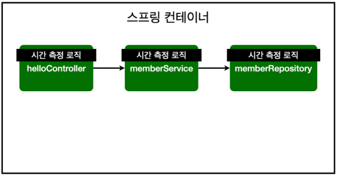
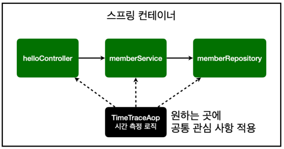
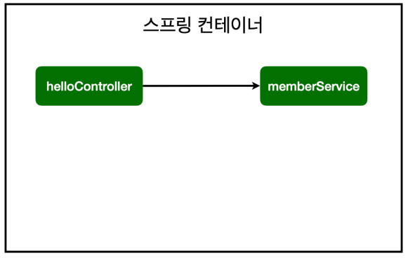
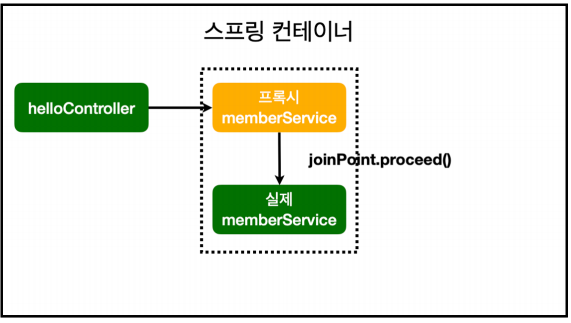
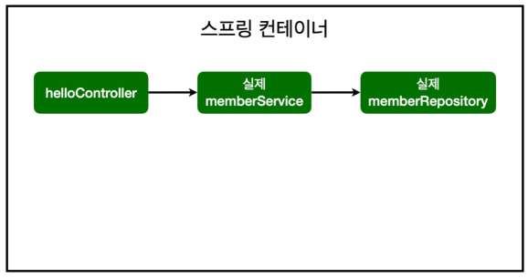
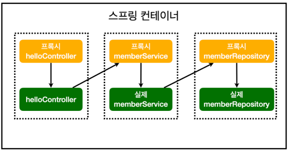

# AOP

## AOP가 필용한 상황

- 모든 메소드의 호출 시간을 측정하고 싶을 때
- 공통 관심 사항(cross-cutting concern) vs 핵심 관심 사항(core concern)
- 회원 가입 시간, 회원 조회 시간을 측정하고 싶을 때



### MemberService 회원 조회 시간 측정 추가

```
package hello.hellospring.service;

import hello.hellospring.domain.Member;
import hello.hellospring.repository.MemberRepository;
import org.springframework.transaction.annotation.Transactional;

import java.util.List;
import java.util.Optional;

@Transactional
public class MemberService {

    private final MemberRepository memberRepository;

    public MemberService(MemberRepository memberRepository) {
        this.memberRepository = memberRepository;
    }


    /**
     * 회원 가입
     */
    public Long join(Member member){

        long start = System.currentTimeMillis();

        try {
            validateDuplicateMember(member); //중복 회원 검증
            memberRepository.save(member);
            return member.getId();
        } finally {
            long finish = System.currentTimeMillis();
            long timeMs = finish - start;
            System.out.println("findMembers" + timeMs + "ms");
        }
    }

    private void validateDuplicateMember(Member member) {
        memberRepository.findByName(member.getName())
                        .ifPresent(m -> {
                        throw new IllegalStateException("이미 존재하는 회원입니다.");
                    });
    }

    /**
     * 전체 회원 조회
     */
    public List<Member> findMembers() {

        long start = System.currentTimeMillis();

        try {
            return  memberRepository.findAll();
        } finally {
            long finish = System.currentTimeMillis();
            long timeMs = finish - start;
            System.out.println("findMembers" + timeMs + "ms");
        }
    }

    public Optional<Member> findOne(Long memberId) {
        return memberRepository.findById(memberId);
    }
}
```

### 문제점

- 회원가입, 회원 조회에 시간을 측정하는 기능은 **핵심 관심 사항**이 아니다.
- 시간을 측정하는 로직은 **공통 관심 사항**이다.
- 시간을 측정하는 로직과 핵심 비즈니스의 로직이 섞여서 유지보수가 어렵다.
- 시간을 측정하는 로직을 별도의 공통 로직으로 만들기 매우 어렵다.
- 시간을 측정하는 로직을 변경할 때 모든 로직을 찾아가면서 변경해야한다.

## AOP 적용

### AOP : Aspect Oriented Programming(관점 지향 프로그래밍)

### 공통 관심 사항(cross-cutting concern) vs 핵심 관심 사항(core concern) 분리



### 시간 측정 AOP 등록

```
package hello.hellospring.aop;

import org.aspectj.lang.ProceedingJoinPoint;
import org.aspectj.lang.annotation.Around;
import org.aspectj.lang.annotation.Aspect;
import org.springframework.stereotype.Component;

@Aspect
@Component
public class TimeTraceAop {

    @Around("execution(* hello.hellospring..*(..))")
    public Object execute(ProceedingJoinPoint joinPoint) throws Throwable{
        long start = System.currentTimeMillis();
        System.out.println("Start: " + joinPoint.toString());
        try{
            return joinPoint.proceed();
        } finally {
            long finish = System.currentTimeMillis();
            long timeMs = start - finish;
            System.out.println("End: " + joinPoint.toString() + " " + timeMs + "ms");
        }
    }
}
```

- ` @Around("execution(* hello.hellospring..*(..))")`을 통해 원하는 패키지만 적용 가능

### 해결

- 회원가입, 회원 조회등 핵심 관심사항과 시간을 측정하는 공통 관심 사항을 `분리`한다.
- 시간을 측정하는 로직을 `별도의 공통 로직`으로 만든다.
- 핵심 관심 사항을 깔끔하게 유지할 수 있다.
- 변경이 필요하면 이 로직만 변경하면 된다.
- 원하는 적용 대상을 선택할 수 있다.

### 스프링의 AOP 동작 방식 설명

#### AOP 적용 전 의존관계



#### AOP 적용 후 의존관계



- 프록시라는 가상의 memberService 생성
- `joinPoint.proceed()`를 통해 실제 memberService에 적용

#### AOP 적용 전 전체 그림



#### AOP 적용 후 전체 그림



- 실제 Proxy가 주입되는지 콘솔에 출력해서 확인!!