# 라이브러리
## gradle 누르면 dependencies

* Timeleaf가 사용하는 라이브러리 있고, 그 라이브러리가 쓰는 라이브러리가 연속으로 들어있음.
* springnoot-start web
 - spring bart web
 - spring boot0start -tomcat: 톰캣
 - spring-webmvc: 스프링 웹 MVC
  - 요즘엔 라이브러리 하나를  빌드해서 웹서버에 올리는 내장된 형태
* log로 개발 관리를 해야 심각한 오류 등을 알 수 있기에 system.out.print로 사용하면 안된다.
* springboot에 logging 관랸 라이브러리가 있다.
* 테스트는 junit 5버전 주로 사용. 
* assertj 등은 테스트를 하도록 도와주는 것
* spring/test는 스프링과 통합해서 테스트할 수 있도록 도와줌

# View 환경 설정

## Spring Boot<

* Springdot.io에 들어가서 spring Boot 눌러서 매뉴얼에서 검색
* 정적페이지는 그냥 올려 놓은 것

## Thymeleaf 

 * 템블렛 엔진으로 동적으로 동작

## 동적인 화면 만들기

* 스프링 동작 원리

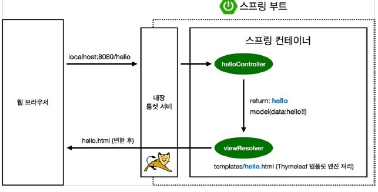  

  
* Controller
  - Hello spring 안에 패키지로 컨트롤러 추가
  - Mvc 패턴 사용하기 위해 model 추가
  - 컨트롤러의 리턴값이 일치하는 이름의  html로 넘어감(뷰 리졸버)
  - Resources:templates/ + 뷰이름 .html
  - 템플렛에서 data는 컨트롤러의 attributeValue값

# 스프링 웹개발 기초

## 정적컨텐츠

-	웹 브라우저에 그대로 올리기
## MVC패턴
  
- Html을 동적으로  변환하는 템플렛 엔진
-	컨트롤러, 템플렛 엔진, 모델 
-	서버에서 변형해서 hmtl을 내리는 방식
## API

-	json이라는 데이터 포멧 사용
-	화면은 클라이언트가 그림
-	서버끼리 통신할 때도 사용
## 정적 컨텐츠(과정)

-	컨트롤러가 확인하고 매핑되는 컨트롤러가 없으면
-	내부에 있는 source에서해ㅙ당 파일을 찾고 있으면 내보냄
## MVC 템플릿 엔진

-	과거에는 컨트롤러와 뷰가 분리되어있지 않았음(모델1)
-	지금은 분리. 뷰는 화면을 보여주는 부분, 컨트롤러와 모델은 비즈니스 로직, 서버와 관련모델은 관련 내용을 담음
-	Tymeleaf 장점: html을 그대로 쓰고 서버 없이 열어도 동작 가능
-	requestParam에 required는 default는 true로 url에 인자 필요(get)
-	스프핑 부트 내장에서 viewResolver가 뷰를 찾아주고 템플릿을 연결 시켜줌
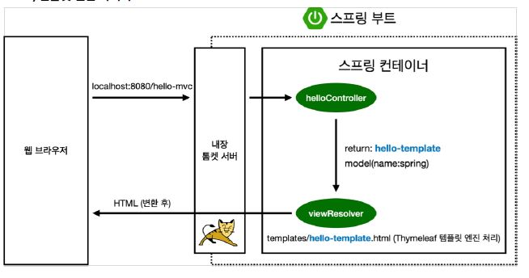

## API 방식

- 
  **ResponseBody**
    - http의 바디부에 집적 넣어 주겠다는 의미
    - 	html은 무겁지만 json이 더 가볍다.
    -	스프링도 json을 반환하는 게 기본

- html 태그가 하나도 없음
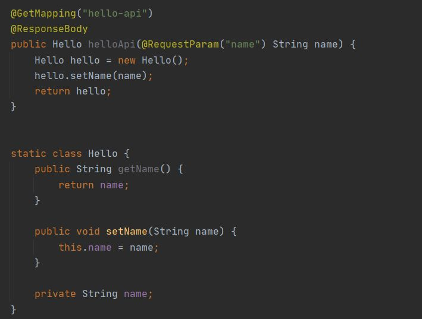

- 자바에서 get, set은 자바빈 표준규약(property 접근방식)
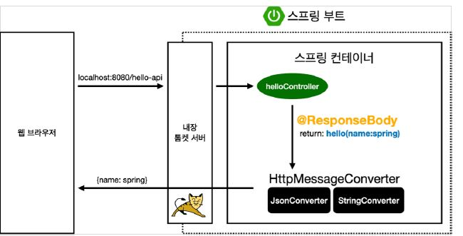

 -	스프링에 Responsebody가 있으면 hrml에 그대로 넘겨주는데, 문자가 아니고 객체를 넘기게 되면 기본 디폴트가 제이슨 방식으로 데이터를 만들어서 반환하겠다.
  -	대표적 라이브러리: MappingJackson2

# 벡엔드 예제 - 회원 관리 

## 도메인 생성
- 아이디, 이름이 있어야함
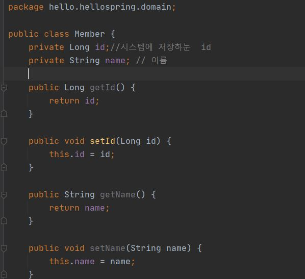

## 리퍼지터리 생성
- 기능 생성
- 회원 객체를 저장하는 저장소
-  인터페이스 생성
   - Optional은 자바 8에서 제공하는 기능. NUL을 반환할 때 감싸서 반환

## 리퍼지터리 구현
- Class로 생성하여 인터페이스 implement
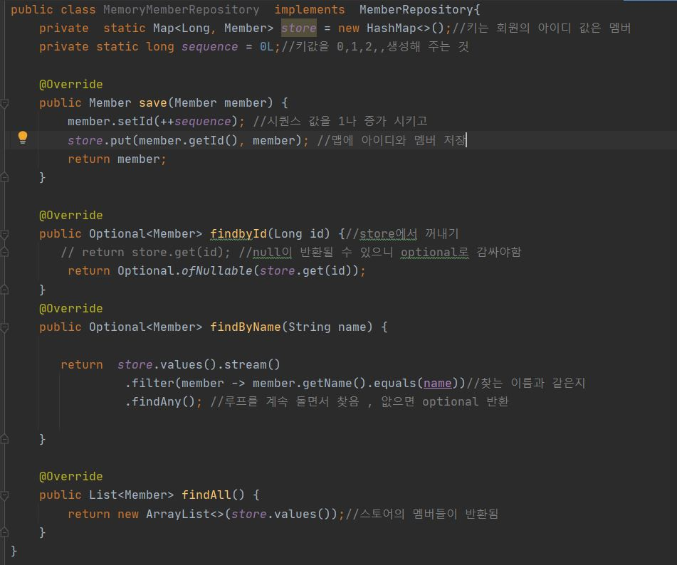

## 테스트 케이스 작성하기
-	코드를 코드로 검증.
-	자바의 메인 메서드를 통해서 실행하거나 웹 애플리케이션의 컨트롤러를 통해 해당 기능을 실행한다. 그러나 이는 반복 실행이 어렵고 여러 테스트 동시하기 어렵다
-	자바 Junit이라는 프레임워크를 사용하는 것이 좋음
    * Shift+F6으로 복사하고 rename가능
- test마다 실행 가능, 전체 테스트들을 포함하는 class를 실행하여 여러 테스트를 동시에 실행할 수도 있음

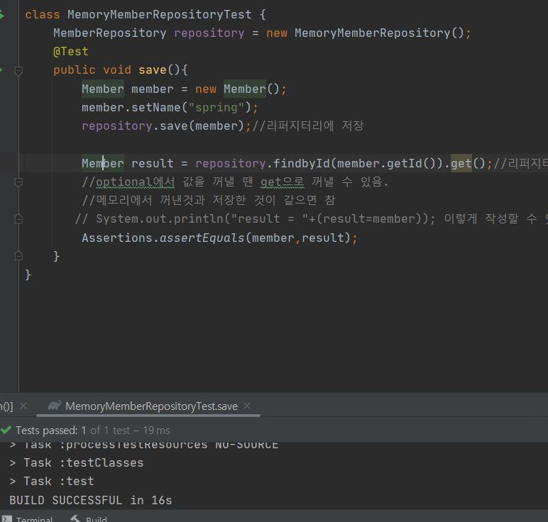
- 순서 의존적으로 테스트 작성하면 안됨
  *  테스트 끝나면 데이터들을 삭제해 주어야함

- 테스트 케이스를 만들고 개발하는 것을 테스트 주도 개발 (tdd)이라고도 함
-	위의 과정은 그 반대
-	그런데 테스트 케이스가 한두개가 아닌 경우 build 또는 gradelw 빌드하면 여러 개를 동시에 테스트 해줌

##	회원 서비스
- 회원 리퍼지터리를 활용하여 비즈니스 로직을 작성
- 관계자들도 보는 파트로 비즈니스적 용어를 사용하여 작성해야 함.
- reflactor에서 extract Method 하면 해당 코드를 따로 메소드로 생성가능

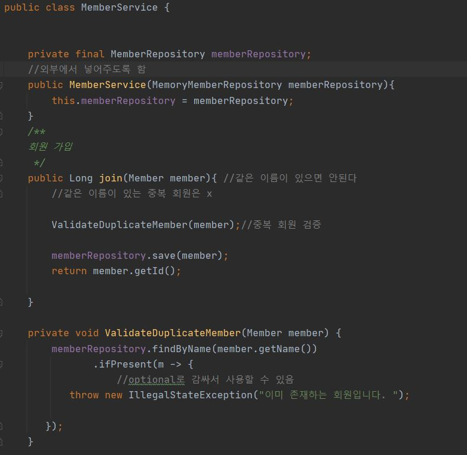
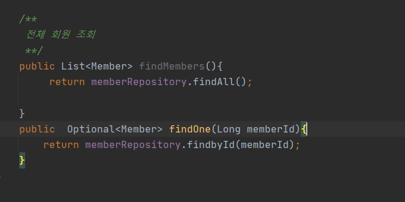

## 서비스 테스트
- 메소드에서 컨트롤 시프트 t+ 방향키 윗키
- 같은 패키지에 자동으로 생성 됨
- 메소드 이름 한글로 해도 됨
- Alt + endter로 스태틱 메소드로 만들 수 있음
- Shift f10하면 이전에 실행한 것 다시 실행
- 서비스에서 멤버 리퍼지터리를 넣어주지않고 외부에서 넣어주도록 함(Defendency rejection)
- given, when, then 순으로 테스트 생각하기

  

# 스프링 빈과 의존 관계

## 컴포넌트 스캔과 자동 의존 관계 설정

-	컨트롤러 선언 시 스프링 컨테이너 안에 스프링 컨트롤러를 스프링이 자동으로 생성해줌
-	컨트롤러에 그냥 서비스 객체를 쓸 수도 있지만 스프링을 이용하려면 스프링이 관리하도록 해주어야함.

###  컴포넌트 스캔과 자동 의존 관계 설정으로 스프링 빈 등록하기 
- @component : 어노테이션 있으면 스프링 빈으로 자동 등록
-	@controller, @Service, @Repository도 컴포넌트 선언포함
-	@Autowired: 생성자에 사용 시 스프링이 해당 스프링빈을 연결시켜줌(생략 가능)
-	아무데나 선언한다고 의미 x . 패키지를 포함한 것 하위에만 의미 있음
-	기본적으로 싱글톤. 유일하게 하나만 스프링 빈을 등록
-	자바 코드로 직접 스프링 빈 등록하기
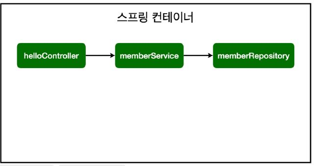
 - 멤버컨트롤러
 - 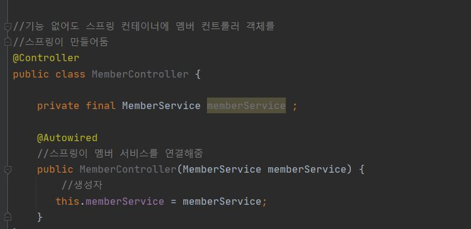

### 자바코드로 직접 스프링 빈 등록하기

- @Service, @Repository, @Autowired 제거
- 
- 과거 xml로 설정 했으나 현재 잘 쓰지않음
- DI는 생성자를 통해 들어오는 방식, 생성자를 뺴고 필드에 Autowired하는 필드 주입방식(비추천), seter을 통해 주입하는 seter 주입방식(public으로 열려 있어야하는 단점)
- 생성자를 통한 방식을 가장 추천

# 회원 관리 - MVC 패턴 예제

-	먼저 매핑된게 있는지 먼저 보기 때문에 기존의 index.html보다 매핑에 적어둔 경로인 “/”이 있기에 실행하면 home이 실행된다. 
-	보통 데이터 등록 post, 조회할땐 get 사용
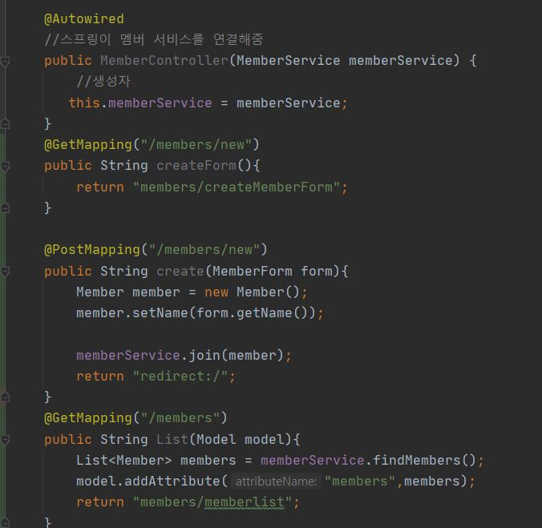
-	${}-> 이 표시는 모델 안에 있는 값 가져온다는 의미

-	메모리에 저장되는 것으로 서버 지웠다가 다시 키면 데이터 지워짐

# 스프링 DB 접근 기술

-	실무에선 DB에 저장함
-	JPA 사용하면 객체를 쿼리없이 DB에 바로 저장할 수 있음
-	스프링 JPA는 JPA를 편리하게 쓸 수 있도록 해주는 기술

## H2 데이터베이스 설치
- H2 접속후 최초의 데이테베이스 파일 생성해야함
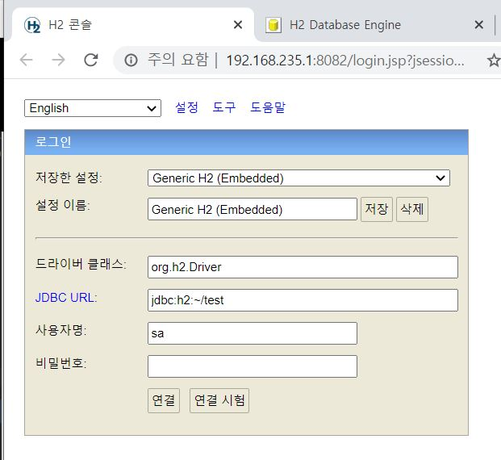
- 생성된 DB는 소켓을 통해 접근

## 순수 JDBC

- Property에 DB 경로 추가
- 스프링을 쓰는 이유? 다형성을 활용하도록 스프링 컨테이너가 잘 제공해줌. 
- 기존의 코드를 손대지 않고 어플리케이션을 조립하는 코드만 고쳐도 가능하게 해준다(스프링 장점)
- 개방 폐쇄 원칙(OCP)
- 확장에는 열려 있고, 수정, 변경에는 닫혀 있다.
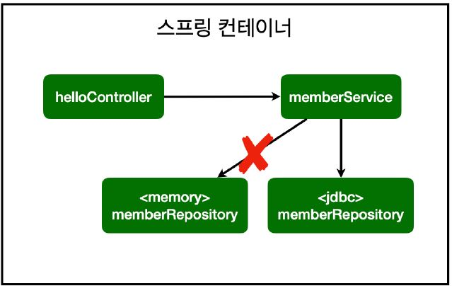

## DB 통합 테스트 
- @springBootTest: 스프링 컨테이너와 테스트 함께 실행
- @Transactional: 테스트 시작전에 트랜잭션 시작하고 테스트가 끝나면 Rolllback을 해줌. DB에 데이터가 남지 않아 다음 테스터에 영향을 주지 않음

## jdbc 템플렛
-	순수 jdbc 와 동일한 환경 설정
-	JDBC API에서 반복 코드를 제거해준다.
-	Sql은 직접작성해야함
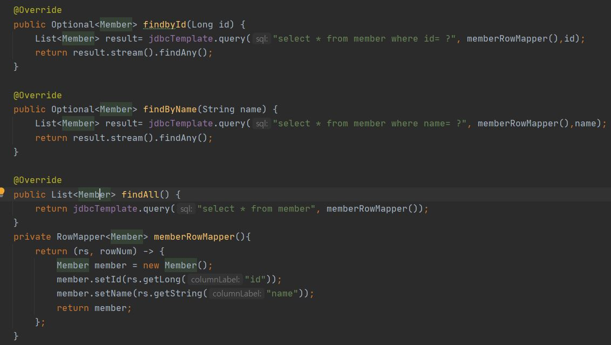

## JPA
- JPA를 사용하면, SQL과 데이터 중심의 설계에서 객체 중심의 설계로 패러다임을 전환을 할 수 있다.
-	쿼리 만들지 않아도 jpa가 알아서 생성해줌
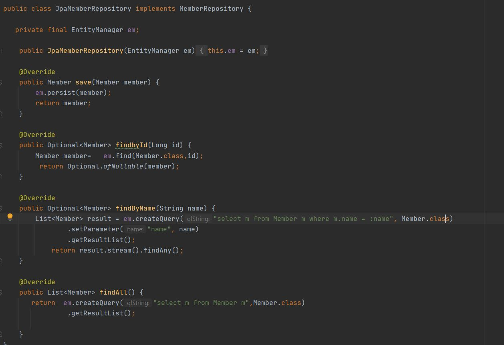
-	항상 트렌젝션 있어야함(데이터 저장, 변경할 때) -> @Transectional

## 스프링 데이터 JPA
- 현장에서 많이 사용
-	JPA를 학습 후에 데이터 JPA를 학습하는 것을 권장
-	스프링 데이터가 기본적인 기능이 구현되어있기에 가져와서 쓰면 된다. 하지만 없는 기능은 findByName과 같이 규칙이 있는 이름으로 인터페이스 메서드를 생성하면 구현되어있는 것을 가져올 수 있다. 

- 스프링 데이터 JPA의 제공 클래스
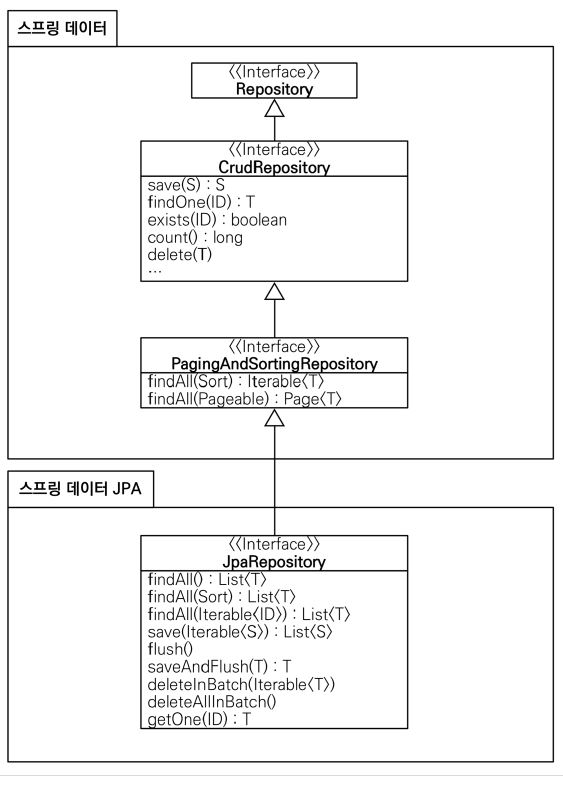

## AOP가 필요한 상황
- 모든 메소드의 호출 시간을 측정하고싶다면?
  - 유지보수 어렵
  - 공통 관심사항임(cross-cutting concern)

## AOP 적용
- 한군데 원하는 곳에 공통 관심 사항 적용
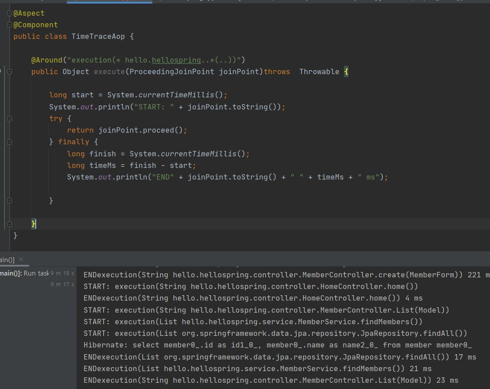
-	자바 class 생성 후 빈에 등록해서 쓸 수 있음(@component로 할 수도 있음)
-	@Arround를 통해 타켓팅을 할 수 있음
-	변경사항있으면 이 로직만 수정하면 됨
-	원하는 적용 대상을 선택할 수 있음
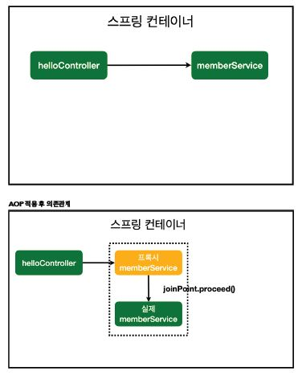
-	스프링은 AOP를 적용하기 전에는 의존 관계가 호출. 
-	AOP가 있으면 가짜 스프링빈(프록시)을 만들어서 가짜 스프링빈이 끝나면 진짜 서비스가 호출
