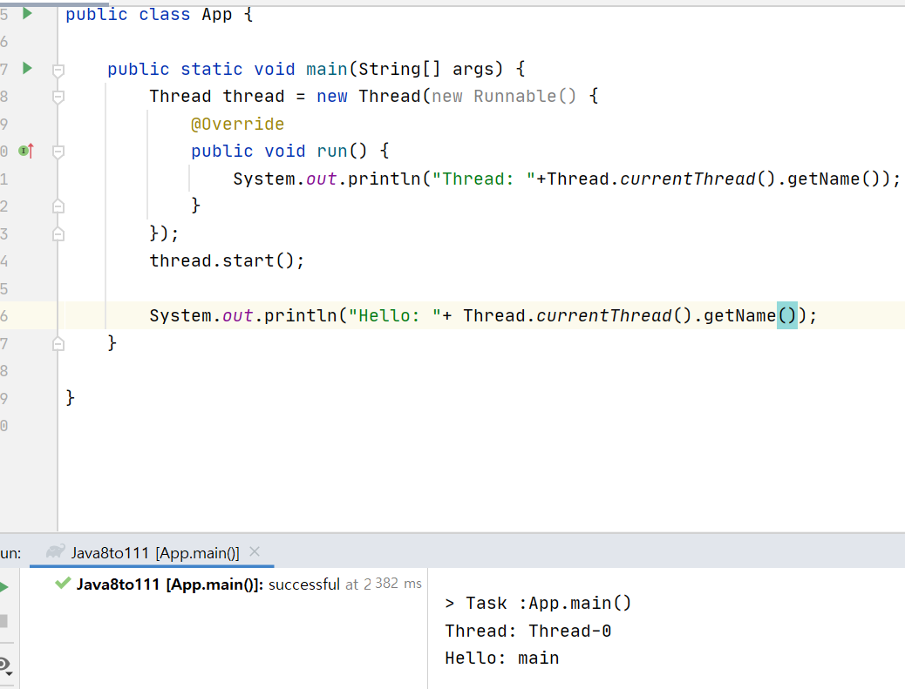
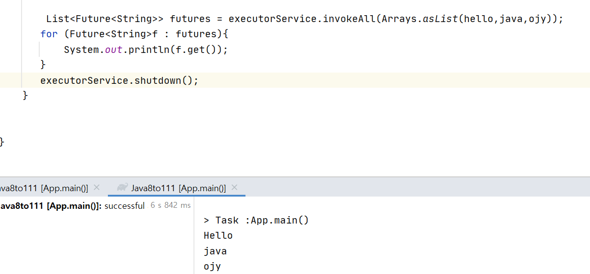
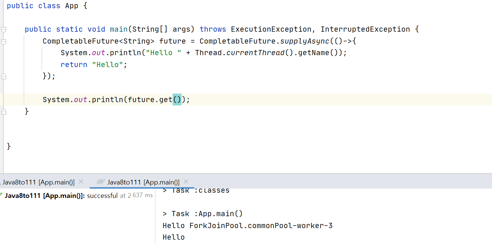
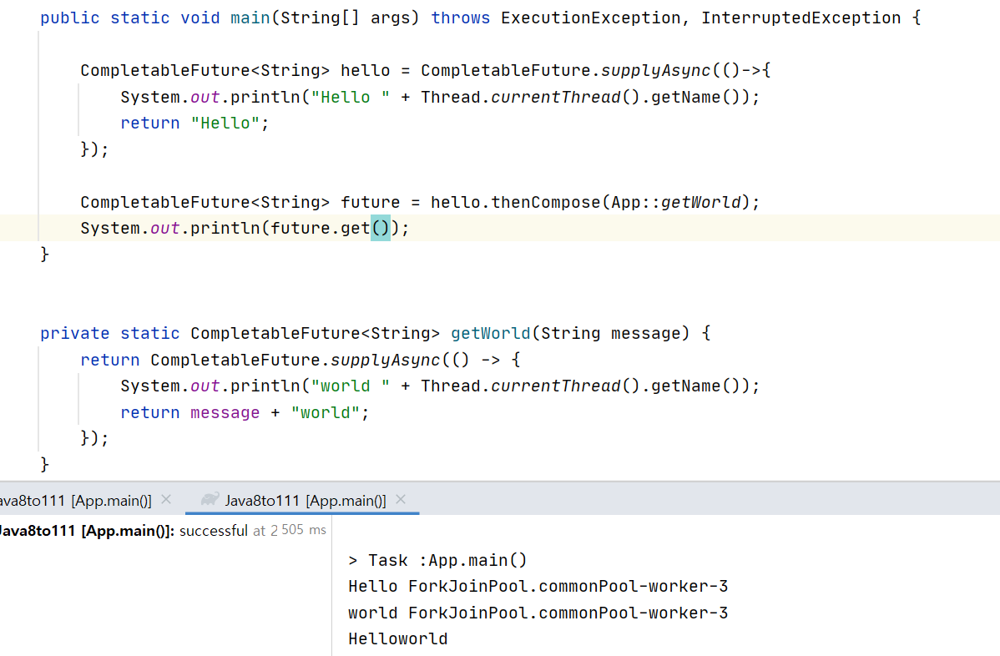

# CompletableFuture

### 자바 Concurrent 프로그래밍 소개

---------------------------

**Concurrent 소프트웨어**
- 동시에 여러 작업을 할 수 있는 소프트웨어
- ex) 웹브라우저로 유튜브를 보면서 키보드로 문서에 타이핑을 함
- 백그라운드에서 여러 프로세스가 돌아가고 있음

자바에서 지원하는 컨커런트 프로그래밍
- 멀티 프로세싱
- 멀티쓰레드

**자바 멀티쓰레드 프로그래밍**
- Thread/ Runnable

1. Thread 상속

    

    - mythread가 먼저 출력될 것 같지만 main에 있는 hello가 먼저 출력됨

2. Runnable

    

 

**쓰레드 주요기능**

1. sleep: 다른쓰레드한테 우선권이 가서 먼저 처리할 수 있도록 함

    

    - main이 무조건 우선순위를 차지하여 먼저 출력

2. Interupt : 다른 쓰레드를 깨워서 InteruptedException을 발생시킴. 종료시킬 수도 있고 계속 하던 일 할 수 도 있음

    

    - 만약 interrupt를 받았음에도 종료하지 않는다면 계속 thread를 출력함

3. join : 다른 쓰레드가 끝날 때까지 기다림

    

*수십수백개의 프로그래밍에서 이러한 쓰레드를 직접 코딩으로 관리하기 힘듬 -> executors->future*

 

### Executors

---------------

**고수준 (High-Level) Concurrency 프로그래밍**
- 쓰레드를 만들고 관리하는 작업을 애플리케이션에서 분리
- 이기능을 executors에게 위임

**Executors가 하는 일**
- 스레드 만들기: 애플리케이션이 사용할 쓰레드 풀을 만들어 관리
- 쓰레드 곤리: 쓰레드 생명주기 관리
- 작업 처리 및 실행:쓰레드로 실행할 작업 제공하는 API 제공

**주요 인터페이스**
- Executor: execute(Runnable)
- ExecutorService: Executor 상속 받은 인터페이스로 Callable도 실행 가능
    - 다른 작업이 들어올때까지 계속 대기함
    - 계속 프로세스가 돌아가기때문에 shutdown(지금돌고 있는 프로세스를 끝네고 중지)을 해야함

        

    - 쓰레드 2개를 가진 excutor service도 만들 수 있음

        

        - main 에서 thread 가 들어가기 전에 대기하는 프로세스들은 blocking q에 있음

- ScheduledExecutorService: : ExecutorService를 상속 받은 인터페이스로 특정 시간
이후에 또는 주기적으로 작업을 실행    
    

 

### Callable과 Future

----------------

Callable : Runnable과 유사하지만 작업의 결과를 받을 수 있음

Future : 비동기적인 작업의 현재상태를 조회하거나 결과를 가져올 수 있음

*결과를 get()으로 가져오기*

- 결과 값을 가져올때까지 기다림
- 블록킹 콜
- 타임아웃을 설정할 수 있음

*작업 상태 확인 isDone()*

- false면 대기 true면 실행중

*작업 취소 cancel*

- true면 현재 작업중인 프로세스를 인터럽트하고 종료, false는 대기
- isDone은 true(cancel를 했기때문에 종료)
- get을 해서 가져올 수 없음(에러)

*여러 작업 동시 실행invokeAll()*

- ojy,hello가 다끝났어도 java가 끝날때까지 기다림
- 동시에 실행한 작업 중에 제일 오래 걸리는 작업 만큼 시간이 걸림

*여러 작업 중에 하나라도 먼저 응답이 오면 끝내기 invokeAny()*

- 블록킹 콜
- 동시에 실행한 작업 중에 제일 짧게 걸리는 작업만큼 시간이 걸림

 

### CompletableFuture1

--------------------

*Future의 단점*

- Future를 외부에서 완료 시킬 수 없음. 취소하거나 get()에 타임아웃을 설정할 수 없음
- 블록킹 코드를 사용하지 않고서는 작업이 끝났을 대 롤백을 실행할 수 없음
- 여러 Future 조합 x
- 예외처리용 API를 제공하지 않음

**Completable Future**
- 외부에서 명시적으로 complete를 시킬 수 있음
- 명시적으로 executors를 만들어 사용할 필요 없음
    - 이것만 가지고 비동기적으로 작업들을 실행할 수 있음

        
    
 

**비동기로 작업 실행하기**

1. 리턴값이 없는 경우: runAsync()

    

2. 리턴값이 있는 경우: supplyAsunc()

    

*get은 꼭 있어야 일이 일어남*

**콜백 제공하기**

1. thenAppy(Function): 리턴값을 받아 다른 값으로 바꾸는 콜백
    
    

2. thenAccept(Consumer): 리턴값을 또 다른 작업을 처리하는 콜백(리턴없이)

    

3. thenRun(Runnable):리턴값 받지않고 다른 작업을 처리하는 콜백

    

*별다른 executor사용하지 않아도 내부적으로 forkjoinpool에 있는 commonpool을 사용하지만 원한다면 얼마든지 만들어서 쓸 수 있음*

 

### CompletableFuture2

---------------------

**조합하기**

1. thenCompose(): 두작업이 서로 이어서 실행하도록 조합

    

2. thenCombine(): 둘이 따로 실행하고 둘다 종료했을 때 콜백 실행

    

    

3. allOf(): 여러 작업을 모두 실행하고 모든 작업 결과에 콜백 실행
    - allof또한 둘다 실행하지만 결과값이 동일하다는 보장도 없고 에러가 났을 수도 있으므로 무의미함
        - null
    - 아무것도 블럭킹이 일어나지 않음

    

4. anyOf(): 여러 작업중에 가장 빨리 끝난 하나의 결과에 콜백 실행

    

    - 둘중에 먼저 끝나는 프로세스가 오므로 랜덤하게 출력됨

 

**예외처리**

1. exceptioinally(Function)
    - 에러타입을 받아 function을 넘겨주어 default값을 출력할 수 있음

    

2. handle(BiFunction)
    - 정상적으로 종료했을때랑 비정상적으로 종료했을때 두가지 모두 사용가능

    