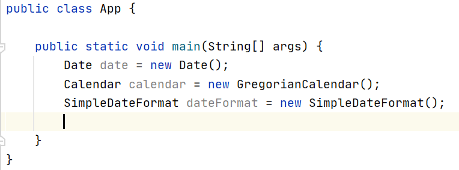
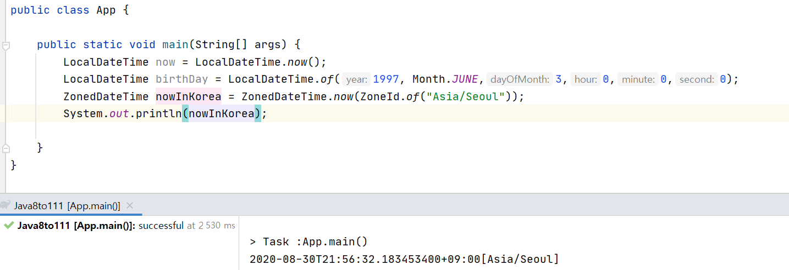
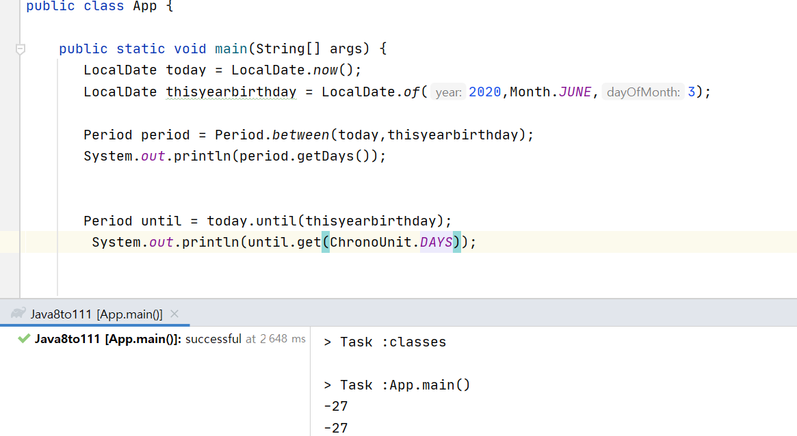
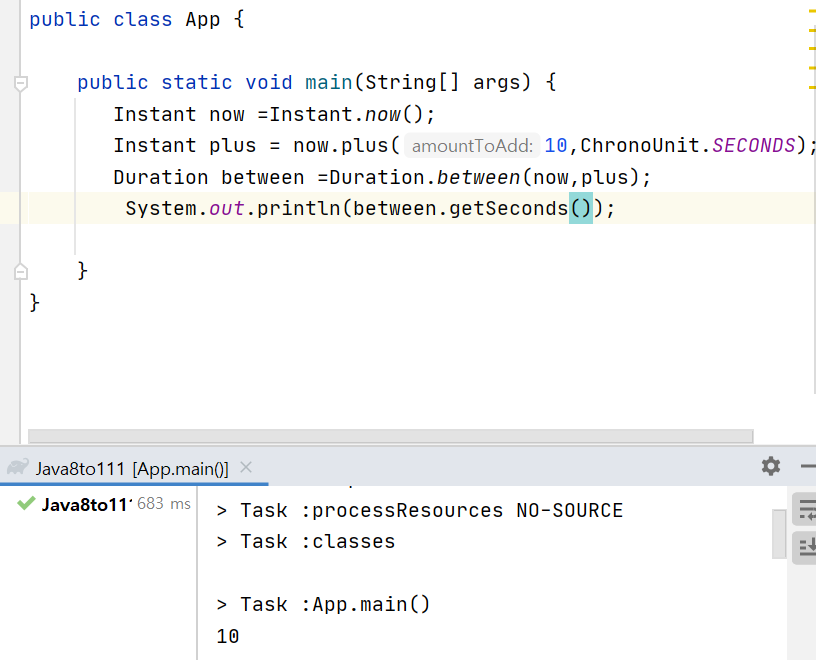
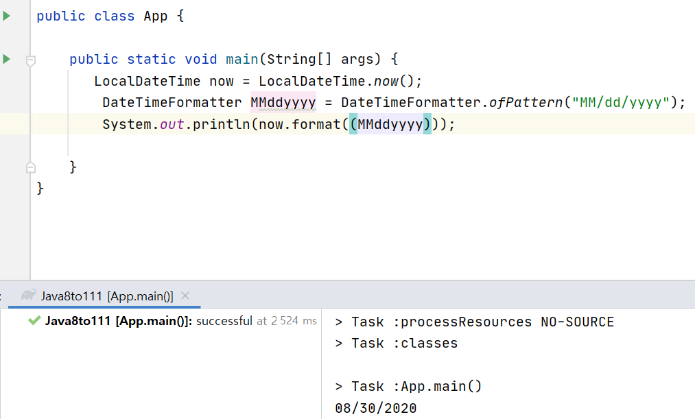
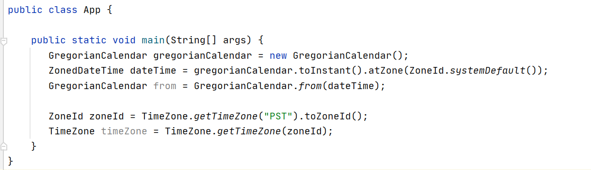

# Date

### Date와 Time 소개

----------------



- 작명이 제대로 되있지않음
    - date는 timestamp임(날짜에서 시간을 가져옴??)
- 버그 발생할 여지가 많음(타입 안정성이 업고, 월이 0부터 시작하기도 함)
- mutable하기 때문에 멀티쓰레드 환경에서 안전하게 쓰기 어려움
     - 오퍼레이션하는 중간에 다른쓰레드가 중간에 끼어들어 전혀 다른 값으로 바뀔 수 있음
- 날짜 시간 처리가 복잡한 애플리케이션에서는 보통 Joda Time을 쓰곤했음
    - java8에서 표준으로 나오게 됨

<br/>

**Date-Time API**
- clear
- Fluent : null을 리턴하거나 받지 않으므로 ...으로 이어감
- Immutable : 기존의 인스턴스에 추가하면 새로운 인스턴스가 만들어짐
- Extensible 

**주요 API**
- 기계용/사람용 시간이 있음
    ```
    long time = date.getTime()

    //기계용 시간
    ```
- 인류용 시간은 localDate,localTime등이 있음
- 기간을 표현할때는 Duration(시간, 몇초), Period(날짜)를 사용할 수 있음
- DateTimeFormatter를 사용해서 일시를 특정한 문자열로 포매팅할 수 있음


<br/>

### Date와 Time API

--------------------

**현재시간으로 표현**

1. instant.now() : 현재 UTC(GMT) 리턴
     - local로 하고 싶다면 instant.atZone 이용
     - UTC == GMT
     ```
     Instant now = Instant.now();System.out.println(now);
    System.out.println(now.atZone(ZoneId.of("UTC")));
    ZonedDateTime zonedDateTime = now.atZone(ZoneId.systemDefault());
    System.out.println(zonedDateTime);
    ```

<br/>

**인류용 일시 표현**

1. localDateTime.now(): 현재 로컬 시간을 가져옴

2. localDateTime.of(int, Month, int, int ,int ,int): 특정 로컬 시간을 리턴

3. ZonedDateTime.of(int, Month, int, int ,int ,int): 특정 zone 의 일시를 리턴
    
    

    - Instant 후 zoned도 가능

<br/>

**기간을 표현**

1. period : 사람용 기간을 날짜 차이로 볼 수 있음

    

2. Duration : 기계용 시간

    

<br/>

**파싱 또는 포매팅**

1. DateTimeFormatter : 패턴을 정의 할 수 있음

    

    - 미리 정의된 것도 있으니 참고해서 쓰면 좋음

2. parse 
    ```
    LocalDate parse = LocalDate.parse("30/08/2020",MMddyyyy);
    ```

<br/>

**레거시 API 지원**

새로운 API들이 예전 API와 호환 

ex) Date에서 Instant로 Instant에서 Date로 만들 수 있음

- GregorianCalendar와 Date타입의 인스턴스를 Instant나 ZonedDateTime으로 변환 가능
- java.util.TimeZone에서 java.time.ZoneId로 상호 변환 가능

    