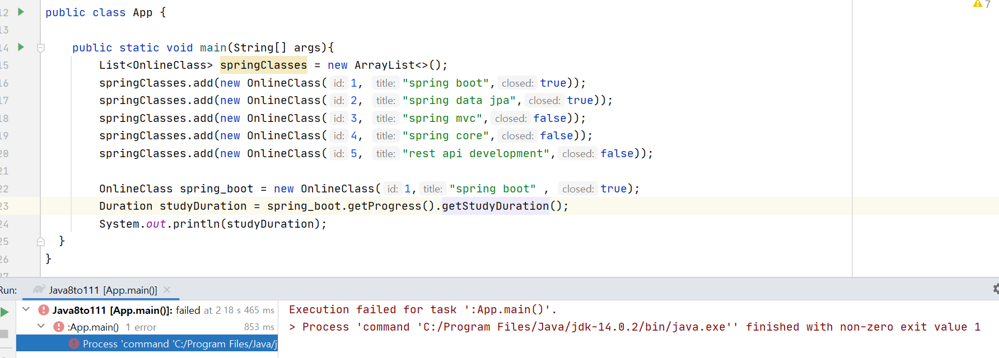
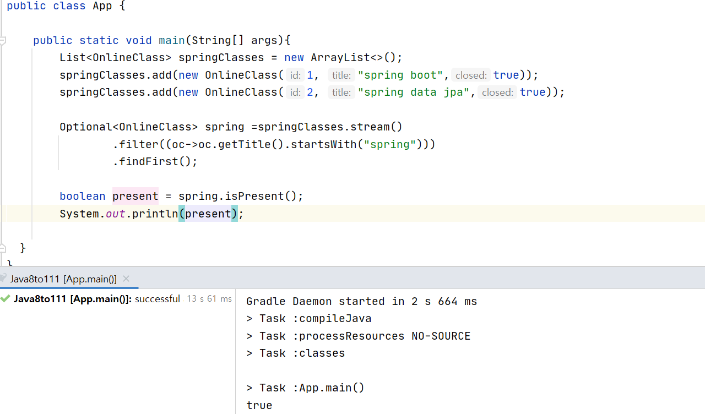
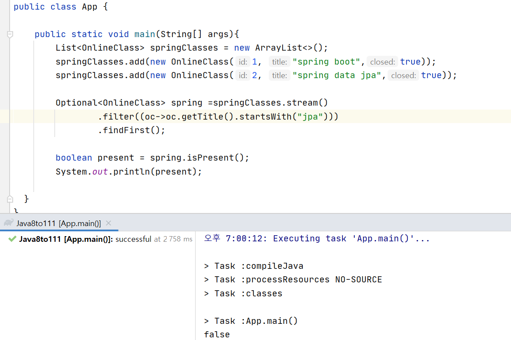
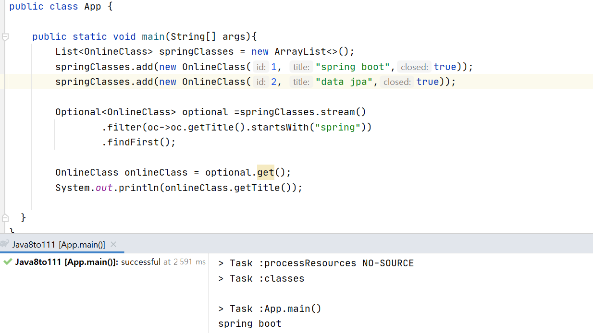
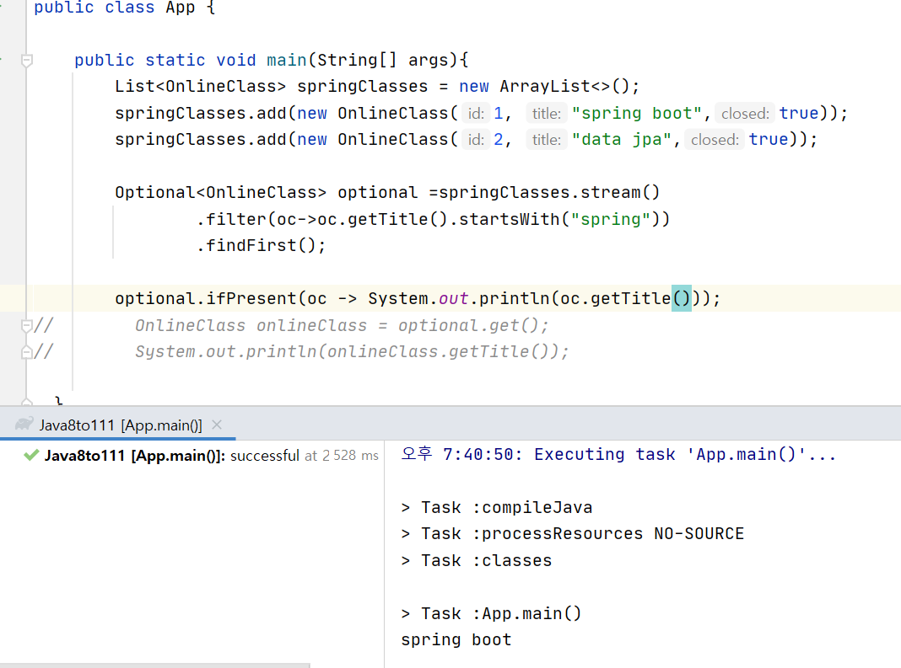
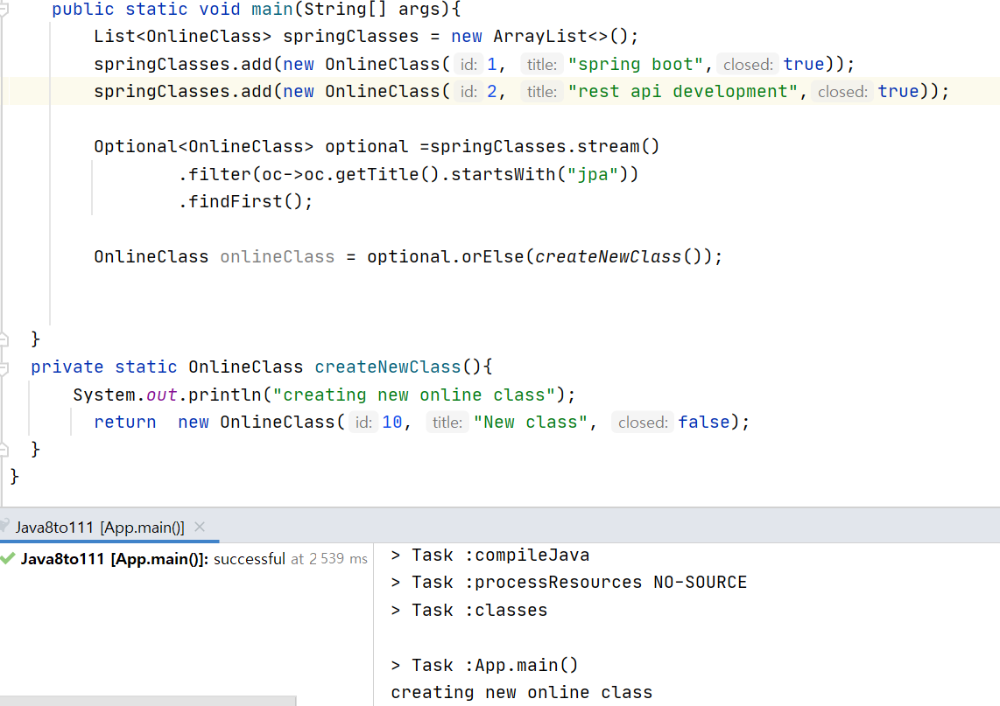
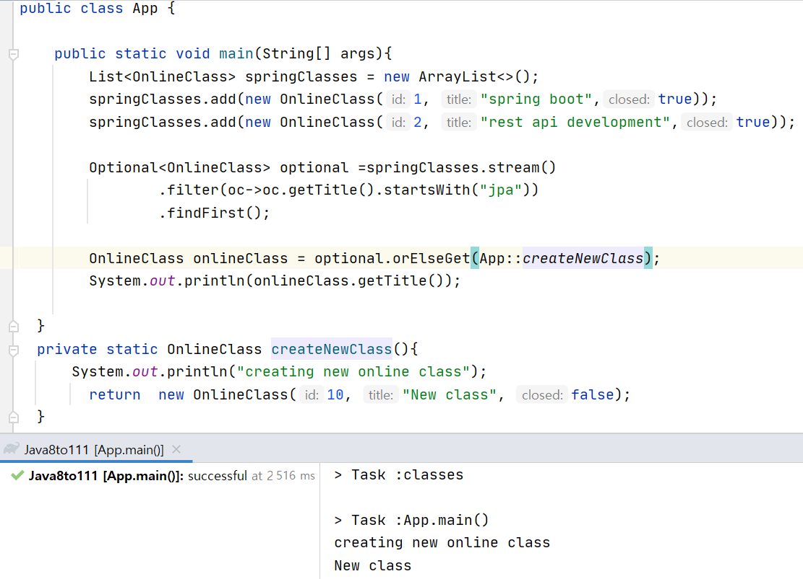
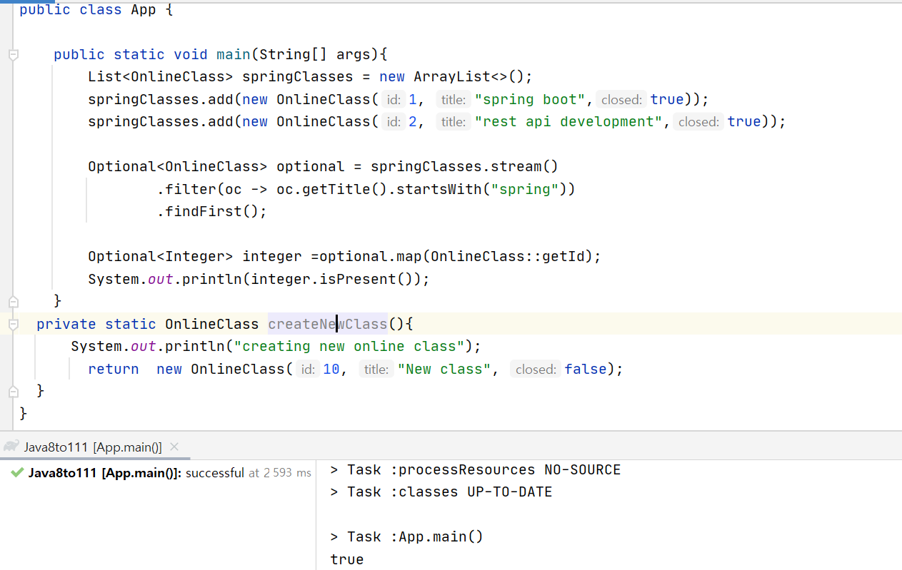

# Optional

### Optional 소개

-------------------------



- NullPointerExcption이 나옴
- if문으로 null 처리를 해도 에러를 만들기 좋은 코드라는 것
     - null 체크를 까먹을 수 있기 때문에
- null을 리턴하는 것 자체가 문제

*메소드에서 작업 중 특별한 상황에서 값을 제대로 리턴할 수 없는 경우 선택할 수 있는 방법*

- 예외를 던진다
    - stacktrace를 찍으므로 이 자체로 리소스를 쓰게되므로 로직에 리소스를 쓰는 것은 좋지 않음

- null을 리턴한다
 

 **Optional**

 - optional안에 값을 넣을 때 인퍼런스 타입이 널일 수 있으면 ofNullable을 씀
    - null이면 optional이 비어있는 것으로 처리함
 - of는 뒤에 null일 수가 없음
 - 리턴값으로만 쓰기를 권장함
    - 매개변수 타입으로 하면 체크를 해야하고 optional을 하는 의미도 없고 오히려 번거로움
    - map의 key타입으로 쓰는 것도 않좋은데 key는 null일 수 없는데 optional은 key를 null일수도 있게 함
    - 인스턴스 필드 타입은 프로그레스가 있을수도 있고 없을 수도 있게하는 것이 안좋음
- 프리미티브 타입용 Optional이 따로 있음
    ```
    OptionalInt.of(10);
    ```
- Optional을 리턴하는 메소드에서 null을 리턴하지 말자
    - 차라리 Optional.empty()를 리턴하자
- Collection, Map, Stream, Array, Optional은 Optional로 감싸지 말자
    - 이미 Optional로 되어있기 때문에 Optional로 감싸면 두번감싸는 꼴이 됨

<br/>

### Optional API

---------------------

**Optional 만들기**

1. Optional.of()
2. Optional.ofNullable()
3. Optional.empty()

**Optional에 값이 있는지 없는지 확인하기**

1. isPresent()
    
    - 값이 있으면
        

    - 값이 없으면
        

2. isEpty()

**Optional에 값을 가져오기**

1. get() : 있는 값 가져오기

    
    - optional이 비어있는데 무언가를 꺼낸다면 컴파일 에러가 뜸

2. ifPresent(Consumer) : optional에 값이 있는 경우에 그 값을 가지고 ~~를 하라

    

3. orElse(T) : 있으면 꺼내오고 없을 때는 ~~를 하라
    - 있을때는 꺼내오고 없으면 새로운 클래스를 만들어라
        - functional 인터페이스가 들어가는게 아니라 인스턴스가 들어가야함

    

    - 이미 있더라도 클래스 생성

4. orElseGet(Supplier) : Optional에 값이 있으면 가져오고 없는 경우에 ~~를하라
    

    - 있다면 클래스를 만들지 않음

*상수로 이미 만들어져있는 것들을 참고할 때는 orElse가 좋고 동적으로 만들거나 추가해야할 때는 orElseGet이 좋음*

5. orElseThrow() : 값이 있으면 가져오고 없는 경우 에러를 던짐
    - 원하는 에러를 선택하여 명시할 수 있음
    ```
    OnlinceClass onlinceClass = optional.orElseThrow(IllegalStateException::new);
    ```

6. filter(Predicate) : Optional에 들어있는 값 걸러내기
    - 없으면 아무일도 일어나지 않음

7. map(Function) : optional에 들어있는 값 변환
    

8. flatMap : map에 optional로 묶으면 2번 밖으로 다시 꺼내야하는데 flatMap은 Optional 안에 들어있는 인스턴스가 Optional인 경우에 사용하면 편리
