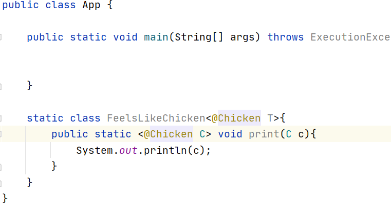

# 그 밖에 ...

### 에노테이션의 변화

---------------------

애노테이션 관련 두가지 큰 변화
- 자바 8 부터 애노테이션을 타입 선언부에도 사용할 수 있게됨
- 자바 8부터 애노테이션을 중복해서 사용할 수 있게됨

타입 선언부
- 제네릭 타입
- 변수 타입
- 매개변수 타입
- 예외 타입

타입에 사용할 수 있으려면
- TYPE_PARAMETER: 타입 변수에만 사용 가능
    
    
    

- TYPE_USE: 타입 변수를 포함해서 모든 타입 선언부에 사용할 수 있음

    
    

 

**중복 사용할 수 있는 애노테이션**

- chicken container안에 chicken 애노테이션의 retention(얼마동안 유지할것인가),target(어디에 선언할 것인가)라는 정보가 container애노테이션안에도 들어감
- container용 리텐션,타겟 위치및 범위가 자신이 가지고 있는 애노테이션보다 같거나 넓어야함

 

### 배열 병렬 정렬

--------------------

**Arrays.parallelSort()**
- Fork/join 프레임워크를 사용해서 배열을 정렬하는 기능을 제공
- 쪼개고 쪼개다가 적당한 사이즈가 되었을때 합치면서 정렬함

*sort()와 parallelSort()비교*

- 알고리듬 효율성은 같음 
- 시간 O(n logN),공간 O(n)

 

### Metaspace

------------------
JVM의 여러 메모리 영역 중에 PermGen 메모리 영역이 없어지고 Metaspace 영역이 생겼다

**PermGen**
- 클래스 메타데이터를 담는 곳
- Heap영역에 속함
- 고정된 사이즈
- 클래스 로딩을 많이하거나 동적으로 클래스를 많이 생성할때 꽉 차는 경우가 생김 -> 에러가 생김
    - permgen size를 늘려도 근본적으로 해결되지는 않음

**Metaspace**
- 클래스 메타데이터를 담는 곳
- Heap영역이 아니라 Native 메모리 영역
- 초기 사이즈는 있지만 고정된 사이즈는 없음
    - Metaspace 최대 사이즈 설정
    - 모니터링을 해서 사이즈값을 주는 것이 좋음

