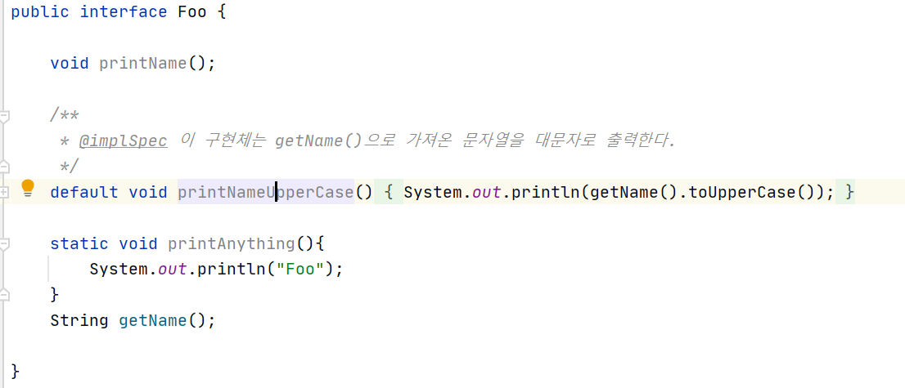

# 인터페이스의 변화

### 인터페이스 기본 메소드와 스태틱 메소드

----------------------------


**기본 메소드(Defualt Methods)**

ex)
1. interface foo
    ```
    default void printNameUpperCase(){
            System.out.println(getName().toUpperCase());
        }
    ```

2. default foo class
    ```
    public class DefaultFoo implements  Foo{

        String name;

        public DefaultFoo(String name){
            this.name = name;
        }

        @Override
        public void printName() {

            System.out.println(this.name);

        }

        @Override
        public String getName(){
            return this.name;
        }
    }
    ```

3. App(main)
    ```
    Foo foo = new DefaultFoo("keesun");

    foo.printName();
    foo.printNameUpperCase();
    ```

4. Result
    ```
    keesun
    KEESUN
    ```

<br/>

- 인터페이스에서 다른 메소드들과 달리 default메소드는 인터페이스를 extends하는 클래스에 명시해주지 않아도 된다

- 인터페이스에 메소드 선언이 아니라 구현체를 제공하는 방법
- 해당 인터페이스를 구현한 클래스를 깨트리지 않고 새 기능을 추가할 수 있음
- 기본 메소드는 구현체가 모르게 추가된 기능으로 그만큼 리스크가 있음
    - 반드시 문서화할것(@implSpec 자바독 태그 사용)

    
- Object가 제공하는 기능(equals, hasCode)는 기본 메소드로 제공할 수 없다
    - 구현체가 재정의해야 한다(Override)

- 인터페이스를 상속받는 인터페이스에서 다시 추상 메소드로 변경할 수 있다
    ```
    public interface Bar extends Foo{
        default void printNameUpperCase();
    }
- 같은 메소드를 가지느 두인터페이스가 있다면 충돌이되어 컴파일 에러가 나온다

<br/>

**스태틱 메소드**

- 해당 타입 관련 헬터 또는 유틸리티 메소드를 제공할 때 인터페이스에 스태틱 메소드를 제공할 수 있다


<br/>

### 자바 8 API의 기본 메소드와 스태틱 메소드

-----------------------

**Iterable의 기본 메소드**

```
public static void main(String[] args){
     List<String> name = new ArrayList<>();
        name.add("Keesun");
        name.add("whiteship");
        name.add("toby");
        name.add("foo");
}
```

1. forEach(): 좀더 손쉽게 iterable을 할 수 있음(= for n in name)
    ```
    name.forEach(System.out::println);
    ```

2. spliterator(): 쪼갤수 있는 iterator)
    ```
    Spliterator<String> spliterator = name.spliterator();

    spliterator.trySplit(); //2개로 쪼갬

    while(spliterator.tryAcvance(System.out::println));
    // 없는경우 false return
    ```


**Collection의 기본 메소드**

1. stream():element들을 stream으로 만들어 functional하게 처리할 수 있게 함
    ```
    name.stream().map(String::toUpperCase)
               .filter(s->s.startsWith("K"))
               .collect(Collectors.toSet());
    System.out.println(k);

    //k만 모아두어 갯수를 셈
    ```

2. removeIf(): 특정한것 삭제
    ```
    name.removeIf(s -> s.startsWith("k"));

    //k로 시작하는 문자 삭제
    ```

<br/>

**Comparator의 기본 메소드 및 스태틱 메소드**

1. reversed(): 문자열 정렬시 역순으로 할때
    ```
    Comparator<String> compareToIgnoreCase = String::compareToIgnoreCase;
    name.sort(compareToIgnoreCase.reversed());
    ```

2. thenComparing(): 또 다른 조건으로 compare하고 싶을때
    ```
    Comparator<String> compareToIgnoreCase = String::compareToIgnoreCase;
    name.sort(compareToIgnoreCase.reversed().thenComparing());
    ```

3. static 메소드들도 추가


<br/>
자바파일이전에는
추상메소드 a,b,c를 가지고 있는 인터페이스가 있다면
API를 제공하는 쪽에서 abstract인터페이스 (a,b,c구현체를 가지고 있는) 추상 클래스를 대부분 만들어다

A가 만들어져있고 B가만들어져있다면 C만 만들면되고 오버라이딩을 하고 싶다면 할수도있고 편의성을 제공함

현재는 인터페이스가 있다면 추상메소드가 아니라 기본메소드로 a,b,c를 만들고 implements를 하여 a,b,c를 함


이전에는 상속을 써서 1개밖에 상속받지 못하였다면 현재는 인터페이스를 사용하여 상속이 자유로워지고 코드도 자유로워짐

