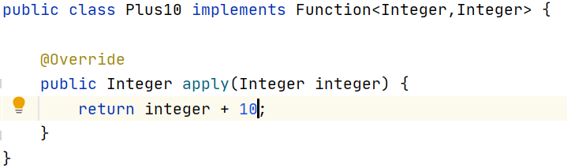
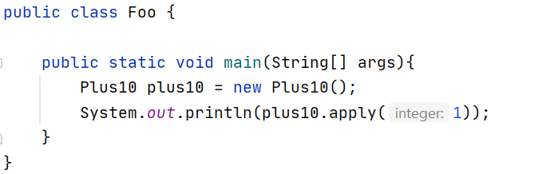
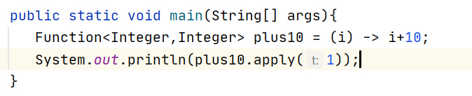
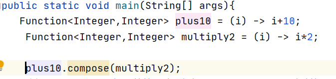
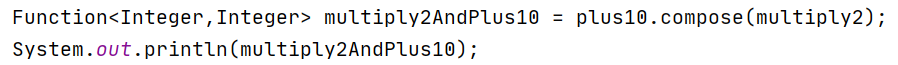
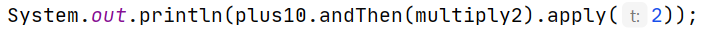
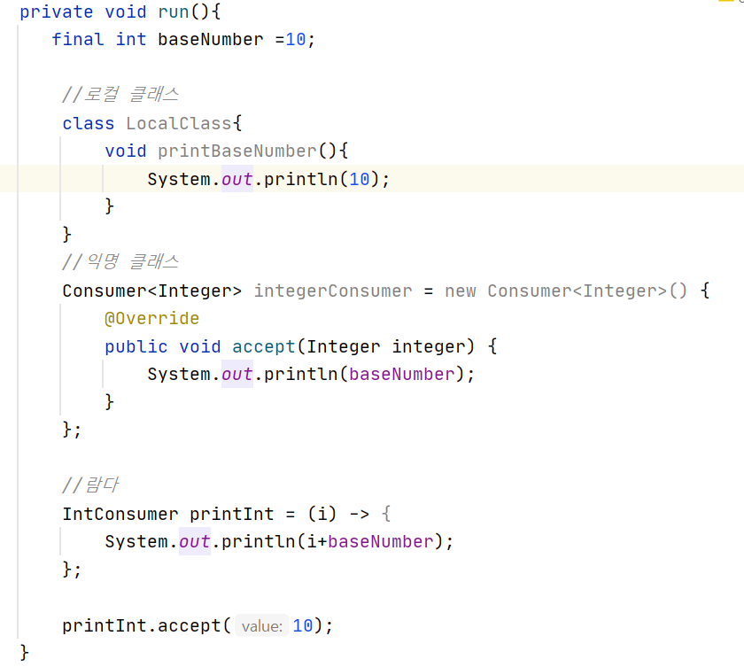
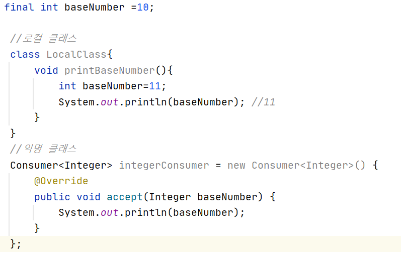
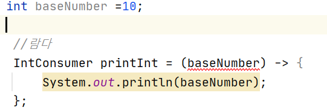
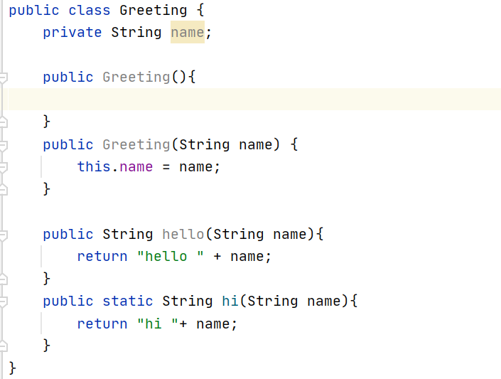

# 함수형 인터페이스와 람다


### 람다식 표현

-----------------
**함수형 인터페이스**

- SAM인터페이스
- @FuncionalInterface에노테이션으 가지고 있는 인터페이스
- 인터페이스 안에서 추상메서드가 2개 있으면 안됨 (abstract 생략가능)

    ```
    public interface RunSomething {

        void doIt(); //1개만

        }

    ```

- static, default등 다른 메소드가 있더라도 추상메소드가 1개 있다면 functional interface이다

    ```
    @functionalInterface
    public interface RunSomething {

        void doIt(); //1개만

        static void printName(){
            System.out.println("Jiyoung");
        }

        default void printAge(){
            System.out.println("24");
        }
    }
    
    ```

위에 @funcionalInterface를 하면 좀더 견고해짐

<br/>


**람다 표현식**

- 함수형 인터페이스의 인스턴스를 만드는 방법으로 쓰일 수 있음
- 코드를 줄일 수 있음
- 메소드 매개변수, 리턴 타입, 변수로 만들어 사용할 수 있음

* 바꾸기 전
    ```
    RunSomething runSomething = new RunSomething(){
        @Override
        public void doIt(){
            System.out.println("Hello");
        }
    }
    ```

* 람다 표현
    ```
    RunSomething runSomething = () -> System.out.println("Hello");
    ```

*함수 안에 한 줄만 있을 경우에만 가능*

<br/>

**자바에서 함수형 프로그래밍**

- 함수를 First class object로 사용할 수 있음
- 고차함수
    - 함수가 함수를 매개변수로 받을 수 있고 함수를 리턴할 수도 있음
- 순수함수
    - 사이드 이팩트가 없다(함수 밖에 있는 값을 변경하지 않음
    )
    - 상태가 없음(함수 밖에 있는 값을 사용하지 않음)
- 불변성

<br/>

*수학적인 함수에서 가장 중요한것은 입력받은 값이 같은 경우 결과값이 같아야한다*

- 순수하지 않은 함수
    ```
    -> int number =10;
    RunSomething runSomething = new RunSomething(){
        -> int number =10; 
        @Override
        public void doIt(){
            System.out.println("Hello");
        }
    }
    ```

<br/>

### 자바에서 제공하는 함수형 인터페이스

------------------

**function은 어떤 값을 받아서 다른 곳에 리턴**
- apply라는 메소드만 구현하면 됨

    
    


    *람다식으로 표현*

    


*함수 2개를 사용하여 값 반환*

1. 함수 2개를 compose
    
    

    - compose를 쓰면 고차함수의 성격으로 multiply2를 먼저하고 그 값을 plus10에 입력값으로 삼음

2. 함수 2개를 1줄로 

    

3. andThen 사용
    - +10을 가고 그 결과값을 이어서 multiply함수에 입력값으로 넣어줌

    


**Consumer**

```
 Consumer<Integer> printT = (i) -> System.out.println(1);
 
 printT.accept(10);
```

**Supplier**

```
Supplier<Integer> get10 = () -> 10;
System.out.println(get10);
```

**Predicate**

```
Predicate<String> startWithOjy = (s) -> s.startsWith("Ojy");
```

**UnaryOperator**

```
UnaryOperator<Integer> plus10 = (i) -> i+10;
UnaryOperator<Integer> multiply2 = (i) -> i+2;

System.out.println(plus10.andThen(multiply2).apply(2));
```

### 람다 표현식

*example*

1. 인자가 1개일 경우
ex1)

```
Supplier<Integer> get10 = () -> {
            return 10;
        };

or

Supplier<Integer> get10 = () -> 10;
```

2. 인자가 2개 이상일 경우

```
BinaryOperator<Integer> sum = ( a, b) -> a+b;
```

***변수 캡처***



- 로컬 변수 캡처
    - final이거나 effective final인경우에만 참조 가능
    - 그렇지 않을 경우 concurrency 문제가 생길 수 있어서 컴파일 방지한다
- effective final
    - 사실상 final인 변수
    - final 키워드 사용하지 않은 변수를 익명클래스 구현체 또는 람다에서 참조할 수 있다
- 익명 클래스와 달리 람다는 쉐도잉 하지 않음
    - 익명 클래스는 새로 스콥을 만들지만, 람다는 람다를 감싸고 있는 스콥과 같다

    
    


### 메소드 레퍼런스

----------------------

람다가 하는 일이 기존 메소드 또는 생성자를 호출하는 거라면, 메소드 레퍼런스를 사용해서 매우 간결하게 표현할 수 있다

***메소드 참조하는 방법***



1. 스태틱 메소드 참조

타입::스태틱 메소드

```
public static void main(String[] args){
        UnaryOperator<String> hi =Greeting::hi;
     }
```

2. 특정 객체의 인스턴스 메소드 참조

객체 레퍼런스::인스턴스 메소드

```
Function<String,Greeting> KeesunGreeting = Greeting::new;
Greeting keesun = KeesunGreeting.apply("Kessun");

Supplier<Greeting> newGreeting = Greeting::new;
```

3. 임의 객체의 인스턴스 메소드 참조

타입::인스턴스 메소드

```
public static void main(String[] args){
        String[] names = {"keesun","whiteship","toby"};
        Arrays.sort(names,String::compareToIgnoreCase);

        System.out.println(Arrays.toString(names));
     }
```


<br/>


